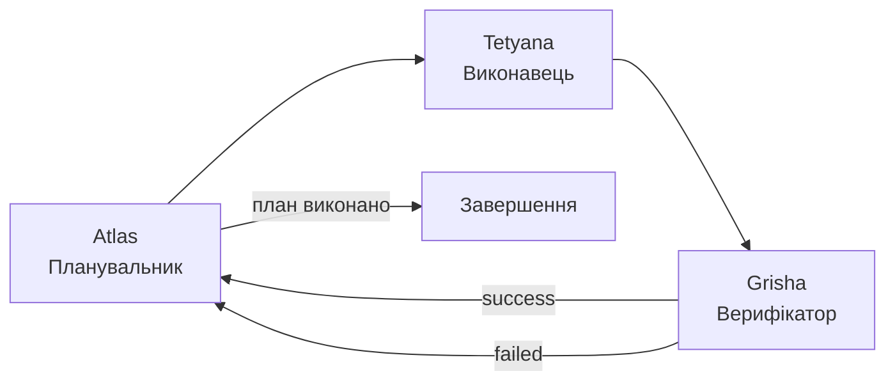

# Project Atlas: Архітектура, Runtime, Workflow та Візія  
**Актуальний стан на грудень 2025 року**

Цей документ є **єдиним джерелом правди** про те, як працює система зараз, які компоненти вже готові, а які знаходяться в активній розробці.

---

## 1. Мета та філософія проекту

**Atlas** — локальний мультиагентний оператор macOS із двома ключовими цілями:

1. **Privacy & Unlimited Access**  
   Інтенсивне використання AI-IDE (Windsurf, Antigravity, Cursor) без блокувань через fingerprint/machineId.  
   → Потужна система очищення, hardware spoofing, «fresh install» режим.

2. **Autonomous macOS Agent**  
   Мультиагентний «мозок» комп'ютера: планування → виконання → верифікація → накопичення досвіду.

---

## 2. Поточні режими виконання

### 2.1 Chat Agent Engine (default)
- Вхід: текст у TUI або CLI (`agent-chat`).
- Поведінка: LLM + tool calls, стримінг, слеш-команди.
- Статус: **стабільний**, ~95% використання.

### 2.2 Trinity Graph Runtime (LangGraph)
- Розташування: [`core/trinity.py`](file:///Users/dev/Documents/GitHub/System/core/trinity.py)
- Архітектура: **Atlas → Tetyana → Grisha → Atlas** (цикл до завершення)



**Поточний статус:**
- ✅ Повністю робочий через `/trinity` або `/autopilot`
- ✅ Окремий стримінг для кожного агента
- ✅ Explicit completion markers (`[STEP_COMPLETED]`)
- ✅ Intelligent success detection (tool results = success)
- 🔧 В активній розробці: стабільність верифікації

---

## 3. Trinity Agents — деталі

### 3.1 Atlas (Планувальник)
**Файл:** `core/trinity.py` → `_atlas_node()`

**Обов'язки:**
- Класифікація задачі (DEV/GENERAL)
- Генерація покрокового плану (JSON array)
- Споживання виконаних кроків
- Ліміти: MAX_STEPS=50, MAX_REPLANS=10

**Ключові trace-події:**
| Подія | Опис |
|-------|------|
| `atlas_enter` | Вхід з поточним станом |
| `atlas_plan_generated` | Новий план створено |
| `atlas_step_consumed` | Крок успішно спожито |
| `atlas_step_failed` | Крок провалився |
| `atlas_dispatch` | Відправка до наступного агента |

### 3.2 Tetyana (Виконавець)
**Файл:** `core/trinity.py` → `_tetyana_node()`

**Обов'язки:**
- Виконання tool calls через MCP Registry
- Permission checks (shell, gui, applescript, file_write)
- Додавання `[STEP_COMPLETED]` маркера при успіху
- Hybrid fallback: native → GUI mode

**Ключові trace-події:**
| Подія | Опис |
|-------|------|
| `tetyana_enter` | Вхід з режимами виконання |
| `tetyana_llm` | Результат LLM (tool_calls count) |
| `tetyana_exit` | Вихід з last_step_status |
| `tetyana_gui_fallback` | Перемикання на GUI режим |

### 3.3 Grisha (Верифікатор)
**Файл:** `core/trinity.py` → `_grisha_node()`

**Обов'язки:**
- Аналіз результатів виконання
- Vision verification (capture_screen + analyze_screen)
- Визначення step_status: success/failed/uncertain

**Логіка визначення успіху (пріоритет):**
1. Test failures → `failed`
2. Tool error (`"status": "error"`) → `failed`
3. Explicit markers (`[STEP_COMPLETED]`, `[VERIFIED]`) → `success`
4. Successful tool results (data без error) → `success`
5. Keywords (успішно, готово, done) → `success`
6. Error keywords → `failed`
7. Uncertain → forced verification

**Anti-loop protection:**
- `uncertain_streak` counter
- 3+ consecutive uncertain → force `success`

**Ключові trace-події:**
| Подія | Опис |
|-------|------|
| `grisha_enter` | Вхід в верифікацію |
| `grisha_llm` | LLM результат |
| `grisha_decision` | Фінальний вердикт |
| `grisha_uncertainty_limit` | Streak limit reached |

---

## 4. MCP Tool Registry

**Файл:** [`core/mcp.py`](file:///Users/dev/Documents/GitHub/System/core/mcp.py)

**Інструменти за категоріями:**

| Категорія | Інструменти |
|-----------|-------------|
| **Vision** | `capture_screen`, `analyze_screen`, `get_monitors_info` |
| **Filesystem** | `read_file`, `write_file`, `list_directory`, `copy_file` |
| **Shell** | `run_shell` (з permission check) |
| **macOS Native** | `run_applescript`, `native_click_ui`, `native_type_text` |
| **GUI** | `move_mouse`, `click_mouse`, `type_text`, `press_key` |
| **Windsurf** | `send_to_windsurf`, `open_file_in_windsurf` |
| **System** | `get_open_windows`, `open_app`, `activate_app` |

---

## 5. Permissions System

**Клас:** `TrinityPermissions` в `core/trinity.py`

| Permission | Інструменти | Default |
|------------|-------------|---------|
| `allow_shell` | run_shell, windsurf tools | False |
| `allow_applescript` | run_applescript, native_* | False |
| `allow_file_write` | write_file, copy_file | False |
| `allow_gui` | mouse/keyboard automation | False |
| `hyper_mode` | All (bypass) | False |

**UI Unsafe Mode** — перемикається в TUI меню, обходить всі підтвердження.

---

## 6. Cleanup & Privacy System

**Найзріліша частина проекту.**

| IDE | Модулі |
|-----|--------|
| **Windsurf** | Full cleanup + MAC/hostname spoofing (4h revert) |
| **Antigravity** | IndexedDB, keychain, fresh install |
| **VS Code** | Side effects cleanup |

Доступно через меню TUI та як інструменти.

---

## 7. Система логування

> [!IMPORTANT]
> **Логи — перше місце для аналізу проблем.**

**Директорія:** `~/.system_cli/logs/`

| Файл | Призначення | Рівень |
|------|-------------|--------|
| `cli.log` | Всі повідомлення | DEBUG+ |
| `errors.log` | Тільки помилки | ERROR+ |
| `debug.log` | Детальні записи | DEBUG |
| `ai.log.jsonl` | Машино-читабельний | DEBUG |

**Конфігурація:** [`tui/logger.py`](file:///Users/dev/Documents/GitHub/System/tui/logger.py)

**Швидкий аналіз:**
```bash
# Останні записи
tail -50 ~/.system_cli/logs/cli.log

# Trinity events
grep -E "(atlas_|tetyana_|grisha_)" ~/.system_cli/logs/cli.log | tail -30

# Тільки помилки
cat ~/.system_cli/logs/errors.log

# JSON для AI аналізу
tail -50 ~/.system_cli/logs/ai.log.jsonl | jq .
```

---

## 8. Швидкий старт

```bash
./cli.sh                    # Запуск TUI
Привіт                      # Швидка відповідь
/menu                       # Головне меню
/trinity Створи файл test.txt з вмістом "Hello"
/autopilot Перевір стан системи
```

---

## 9. Roadmap (Грудень 2025 → 2026)

### Фаза 1: Стабілізація ✅ IN PROGRESS
- [x] Trinity через `/trinity` та `/autopilot`
- [x] Explicit completion markers
- [x] Intelligent success detection
- [ ] Агрегація `final_response` для TUI
- [ ] Cleanup як MCP tools

### Фаза 2: IntelliGate & Vision-first
- [ ] IntelliGate execution bridge
- [ ] Обов'язковий vision feedback loop
- [ ] Auto-inserted checkpoints

### Фаза 3: Full Autonomy
- [ ] Proactive cleanup decisions
- [ ] Antigravity native driver
- [ ] Local models fallback

---

## 10. Відомі проблеми та рішення

| Проблема | Причина | Рішення |
|----------|---------|---------|
| Цикл "виконано → failed → retry" | Grisha не розпізнавав успіх | ✅ Додано detection tool results |
| Uncertain loop | Немає маркерів успіху | ✅ Tetyana додає `[STEP_COMPLETED]` |
| План не споживається | last_step_status != success | ✅ Виправлено логіку Grisha |

---

*Останнє оновлення: 18 грудня 2025*