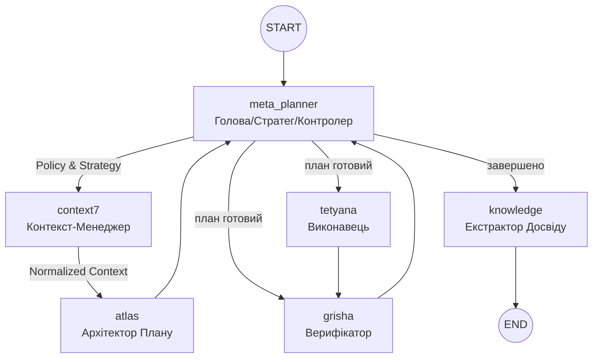

# Project Atlas: Архітектура, Workflow та Основні Принципи  
**Актуальний стан на грудень 2025 року (Cognitive 2.0)**

Цей документ є **єдиним джерелом правди** про фундаментальні принципи роботи системи Atlas (Trinity Runtime).

---

## 1. Основні принципи роботи (Core Principles)

Atlas — це не просто автоматизатор, а **автономний мультиагентний оператор macOS**, що керується наступними принципами:

1.  **Автономна Навігація (Autonomous Navigation)**  
    Здатність самостійно приймати рішення в умовах невизначеності, використовуючи цикл "Сприйняття → Планування → Дія → Верифікація".
2.  **Управління Мисленням (Meta-Planning)**  
    Агент керує власною стратегією: обирає рівень верифікації, режим відновлення та тип плану.
3.  **Візуальне Сприйняття (Vision-First)**  
    Використання скріншотів та Computer Vision як Ground Truth.
4.  **Конфіденційність та Стелс-режим (Privacy & Stealth)**  
    Система очищення слідів та підміна ідентифікаторів (`spoofing`).
5.  **Постійне Навчання (Continuous Learning 2.0)**  
    Система витягує досвід (як успішний, так і негативний) та зберігає його у **Knowledge Base** з оцінкою впевненості та статусом.

---

## 2. Архітектура Trinity Runtime (LangGraph)

Центральна нервова система Atlas базується на циклічному графі. Будь-яка успішна чи завершена місія обов'язково проходить через вузол навчання.



### 2.1 Trinity Agents & Layers

-   **Meta-Planner** (`_meta_planner_node`): Головний оркестратор. Виконує **Active Retrieval** та фільтрує спогади.
-   **Context7** (`context7`): **Explicit Context Manager**. Готує контекст, керує бюджетом токенів та ін'єктує стратегічні політики перед плануванням.
-   **Atlas** (`_atlas_node`): Архітектор тактичного плану. Отримує *нормалізований* контекст від Context7 для розробки кроків.
-   **Tetyana** (`_tetyana_node`): Виконавець (Native/GUI/Playwright).
-   **Grisha** (`_grisha_node`): Верифікатор. У разі успіху або критичного провалу ініціює перехід до навчання.
-   **Knowledge** (`_knowledge_node`): **Етап рефлексії**. Зберігає досвід (`success`/`failed`).

---

## 3. Мета-планінг та Пам'ять (Meta-planning 2.0)

| Параметр | Значення | Опис |
| :--- | :--- | :--- |
| **Strategy** | `linear`, `rag_heavy`, `aggressive` | Тип побудови плану. |
| **Active Retrieval** | `retrieval_query` | Оптимізований запит, сформований Meta-Planner. |
| **Anti-patterns** | `status: failed` | Система уникає стратегій, які призвели до помилок у минулому. |
| **Confidence Score** | `0.1` ... `1.0` | Оцінка надійності спогаду на основі кількості правок та кроків. |
| **Source Tracking** | `trinity_runtime`, `user` | Відстеження походження знання. |

---

## 4. MCP Фондація (Інструменти)

Центральний реєстр `MCPToolRegistry` надає агентам доступ до:

### Внутрішні Інструменти (Internal)
-   **Automation (Unified)**: Уніфікований модуль для Shell, AppleScript, Shortcuts та вводу (миша/клавіатура).
-   **System Cleanup**: Інструменти для очищення слідів, логів та спуфінгу (Stealth Mode).
-   **Recorder Control**: Програмне керування записом сесій (Start/Stop/Status).
-   **Desktop/Vision**: Аналіз екрану, пошук зображень, OCR. Підтримує **Dynamic Focus** (автоматична активація цільового вікна перед знімком).

### Зовнішні MCP Сервери (External)
-   **Playwright MCP**: Повний контроль браузера (headless/headful).
-   **PyAutoGUI MCP**: Альтернативна емуляція вводу (якщо внутрішня недоступна).


---

## 5. Додаткові можливості та Інтеграції (Extensions)

### 5.1 AI-IDE Integrations
-   **Windsurf**, **Antigravity**, **Cursor**, **Continue CLI**: Спеціальні профілі для розробки.

### 5.2 Cleanup & Privacy System
-   Очищення `IndexedDB`, `keychain`, локальних сховищ ШІ.
-   **Spoofing**: MAC, hostname (з авто-ревертом через 4 години).

---

## 6. Система моніторингу та Трейси (Monitoring)

| Event | Опис |
| :--- | :--- |
| `trinity_run_start` | Початок виконання всього графа. |
| `knowledge_stored` | Подія збереження досвіду (статус, впевненість, джерело). |
| `atlas_plan_generated` | Подія створення нового плану. |
| `grisha_decision` | Вердикт верифікатора. |

---

## 7. Швидкий старт

```bash
./cli.sh                    # Запуск TUI
/trinity <завдання>         # Запуск Trinity
/autopilot <завдання>       # Режим повної автономії
```

---


---

## 8. FAQ & Advanced Capabilities

### 8.1 Режим Розробника (Dev Mode)
Atlas може працювати в розширеному режимі (Dev Mode), що дозволяє:
-   **Direct Code Editing**: Агент може читати та змінювати код власної системи (через `multi_replace_file_content`).
-   **Shell Execution**: Виконання термінальних команд (включаючи `git`, `npm`, `python`).
-   **Unsafe Tools**: Доступ до потенційно небезпечних інструментів (AppleScript, Mouse Control) за умови підтвердження користувачем (`confirm users`) або в режимі `--unsafe`.

### 8.2 Чи може Atlas "лікувати" себе? (Self-Healing)
**Так.** Це закладено в архітектуру Trinity Runtime:
1.  **Detection**: Агент-верифікатор (`Grisha`) аналізує результат виконання кожного кроку.
2.  **Correction**: Якщо виявлено помилку (наприклад, `JSON parsing error` або `Element not found`), система ініціює `Replanning Loop`.
3.  **Strategy Shift**: Meta-Planner може змінити стратегію (наприклад, перейти з Native Mode на GUI Mode), якщо попередній підхід не спрацював.
4.  **Limits**: Система має ліміт на кількість спроб (`MAX_REPLANS`), щоб уникнути нескінченних циклів.

### 8.3 Інтерактивність (Chat & Response)
Atlas працює в напівавтономному режимі через TUI (`cli.py`):
-   **User -> Agent**: Ви можете писати команди або уточнення прямо в чат TUI.
-   **Agent -> User**: Агенти використовують тег `[VOICE]` для відправки повідомлень користувачу, які відображаються в інтерфейсі.
-   **Feedback Loop**: Хоча агент фокусується на завданні, він може "чути" нові вхідні дані від користувача під час пауз між кроками, якщо це реалізовано через режим `interactive`.

---

*Останнє оновлення: 19 грудня 2025*
