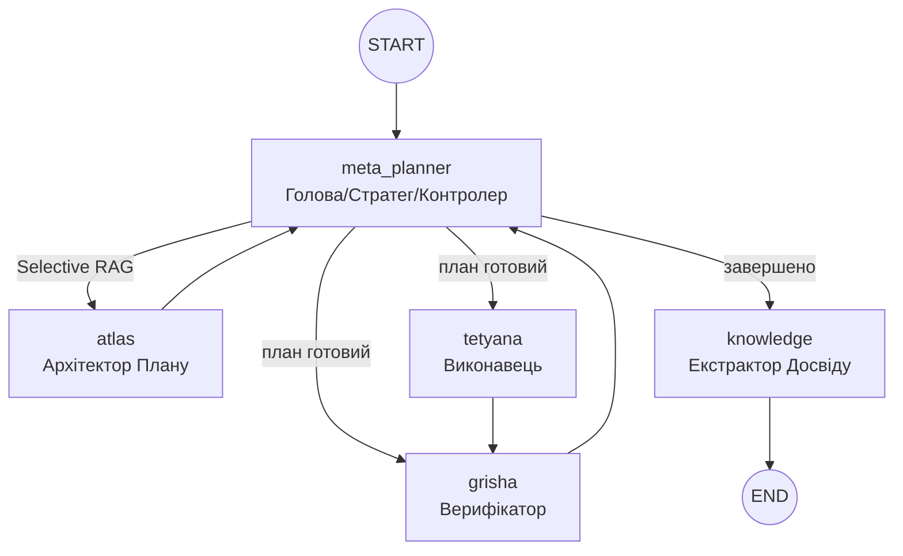

# Project Atlas: Архітектура, Workflow та Основні Принципи  
**Актуальний стан на грудень 2025 року**

Цей документ є **єдиним джерелом правди** про фундаментальні принципи роботи системи Atlas (Trinity Runtime).

---

## 1. Основні принципи роботи (Core Principles)

Atlas — це не просто автоматизатор, а **автономний мультиагентний оператор macOS**, що керується наступними принципами:

1.  **Автономна Навігація (Autonomous Navigation)**  
    Здатність самостійно приймати рішення в умовах невизначеності, використовуючи цикл "Сприйняття → Планування → Дія → Верифікація".
2.  **Управління Мисленням (Meta-Planning)**  
    Агент не просто виконує кроки, він керує власною стратегією: обирає рівень строгості перевірок (`rigor`), режим відновлення (`recovery_mode`) та тип плану.
3.  **Візуальне Сприйняття (Vision-First)**  
    Використання скріншотів та Computer Vision як основного джерела істини (Ground Truth) для підтвердження результатів, особливо в умовах блокувань або відсутності API.
4.  **Конфіденційність та Стелс-режим (Privacy & Stealth)**  
    Потужна система очищення слідів перебування ШІ на macOS, підміна ідентифікаторів (`spoofing`) та режим "Fresh Install" для безпечної роботи.
5.  **Постійне Навчання (Continuous Learning)**  
    Після завершення кожного успішного завдання система витягує досвід та зберігає його у векторну пам'ять (Knowledge Base) для майбутнього використання.

---

## 2. Архітектура Trinity Runtime (LangGraph)

Центральна нервова система Atlas базується на циклічному графі, де кожен вузол має вузьку спеціалізацію:



### 2.1 Trinity Agents

-   **Meta-Planner** (`_meta_planner_node`): Встановлює **Execution Policy**. Виконує **Selective RAG** (вирішує, чи потрібен пошук у пам'яті). Також відповідає за:
    -   **Strategic Reasoning**: Обґрунтування вибору стратегії.
    -   **Summarization**: Кожні 3 кроки стискає історію.
    -   **Step Consumption**: Маркування виконаних кроків.
-   **Atlas** (`_atlas_node`): Перетворює політику та **отриманий контекст** на кроки. Включає фазу **Self-Review**.
-   **Tetyana** (`_tetyana_node`): Виконавець команд.
-   **Grisha** (`_grisha_node`): Валідатор (success/failed/uncertain).
-   **Knowledge** (`_knowledge_node`): Витягує структурований досвід після успіху та зберігає у `knowledge_base` з тегами.

---

## 3. Мета-планінг (Meta-planning)

Мета-планінг — це "мозок" керування агентом. Atlas стає менеджером власного мислення.

| Параметр конфігу | Значення | Опис |
| :--- | :--- | :--- |
| **Strategy** | `linear`, `branching`, `aggressive` | Тип побудови плану. |
| **Verification Rigor** | `low`, `medium`, `high` | Частота та глибина перевірок Grisha. |
| **Recovery Mode** | `local_fix`, `full_replan` | Як реагувати на помилку окремого кроку. |
| **Tool Preference** | `native`, `gui`, `hybrid` | Пріоритет типу інструментів для виконання. |
| **Reasoning** | Текстове обґрунтування | **Strategic Justification**: Чому обрано саме таку політику. |

---

## 4. MCP Фондація (Інструменти)

Atlas взаємодіє зі світом через систему інструментів, що базуються на фундаментальних MCP-серверах:

-   **Playwright MCP**: Повний контроль браузера.
-   **PyAutoGUI MCP**: Фізична миша/клавіатура.
-   **Native macOS MCP**: AppleScript, UI Clicker, Shell Access.

---

## 5. Додаткові можливості та Інтеграції (Extensions)

Ці модулі є допоміжними і розширюють можливості Atlas для специфічних середовищ:

### 5.1 AI-IDE Integrations
Atlas може інтегруватися з редакторами коду для прискорення розробки:
-   **Windsurf**: Інструменти `send_to_windsurf`, `open_file_in_windsurf`.
-   **Antigravity / Cursor**: Спеціальні профілі очищення та налаштування оточення.

### 5.2 Cleanup & Privacy System
Система очищення слідів для обходу лімітів та захисту приватності:
-   Очищення `IndexedDB`, `keychain`, локальних сховищ IDE.
-   Спофінг `MAC-адреси` та `hostname` (revert через 4 години).

---

## 6. Система моніторингу та Трейси (Monitoring)

Для діагностики системи використовуються спеціальні trace-події, які можна знайти в `ai.log.jsonl` та `cli.log`:

| Event | Опис |
| :--- | :--- |
| `trinity_run_start` | Початок виконання всього графа. |
| `trinity_graph_event` | Перехід між вузлами (node name, status, step_count). |
| `atlas_plan_generated` | Подія створення нового плану (кількість кроків). |
| `tetyana_llm` / `tetyana_exit` | Робота виконавця та статус завершення інструменту. |
| `grisha_decision` | Вердикт верифікатора (success/failed/uncertain). |

---

## 7. Швидкий старт

```bash
./cli.sh                    # Запуск TUI
/trinity <завдання>         # Запуск Trinity з Meta-Planner
/autopilot <завдання>       # Режим повної автономії
```

---

*Останнє оновлення: 19 грудня 2025*