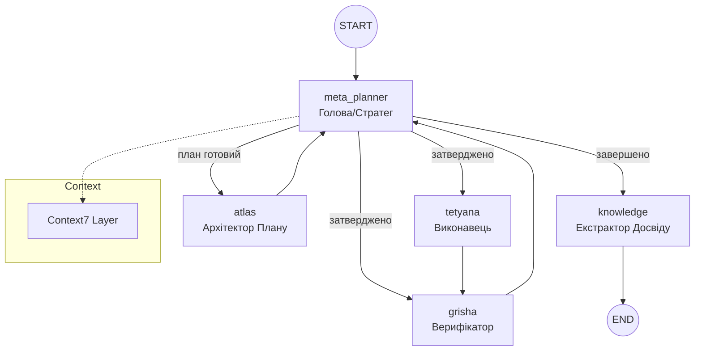

# Project Atlas: Cognitive 2.1 Identity

**Autonomous Multi-Agent macOS Operator built on Trinity Runtime.**

Atlas — це не просто автоматизатор, а **автономний мультиагентний оператор macOS**, що сприймає екран (Vision-First), планує (Meta-Planning 2.1), і виконує дії через MCP інструменти.

**Актуальний стан: Грудень 2025 (Cognitive 2.1 + Trinity Improvements v1.1)**

---

## 🧠 Основні принципи (Core Principles)

1. **Автономна Навігація** — Цикл "Сприйняття → Планування → Дія → Верифікація"
2. **Meta-Planning 2.0** — Агент керує власною стратегією та рівнем верифікації
3. **Vision-First** — Скріншоти та CV як Ground Truth (multi-monitor, диференційний аналіз)
4. **Privacy & Stealth** — Очищення слідів та підміна ідентифікаторів
5. **Continuous Learning 2.0** — Knowledge Base з оцінкою впевненості
6. **State Logging** — Деталізовані логи в `logs/trinity_state_*.log`

---

## 🏗 Архітектура: Trinity Runtime (LangGraph)



### Trinity Agents

| Agent | Role | Description |
|:---|:---|:---|
| **Meta-Planner** | Orchestrator | Active Retrieval та фільтрація спогадів |
| **Context7** | Context Manager | Token budget, sliding window, політики |
| **Atlas** | Architect | Тактичний план на основі контексту |
| **Tetyana** | Executor | Native/GUI/Playwright виконання |
| **Grisha** | Verifier | Візуальна верифікація з `enhanced_vision_analysis` |
| **Knowledge** | Learner | Рефлексія та збереження досвіду |

---

## 🔧 Ключові Підсистеми

### Hierarchical Memory System (`core/memory.py`)

| Шар | Тривалість | Призначення |
|:---|:---|:---|
| **Working Memory** | Поточна сесія | Тимчасові дані |
| **Episodic Memory** | Декілька сесій | Конкретні події |
| **Semantic Memory** | Постійно | Консолідовані знання |

### Vision Pipeline

- **DifferentialVisionAnalyzer**: Multi-monitor, OCR, diff visualization
- **VisionContextManager**: Trend detection, active region tracking
- **Enhanced Analysis**: `capture_and_analyze()` з генерацією diff images

### Context7 Sliding Window

- Token Budget з динамічним керуванням
- Priority Weighting для недавніх кроків
- Priority Weighting для недавніх кроків
- ContextMetrics для відстеження використання

### MCP Prompt Engine (Dynamic Context)
- **Active Retrieval**: Динамічний пошук релевантних промптів та схем для поточного завдання.
- **Large-Scale Knowledge**: Індексація тисяч промптів з GitHub (Fabric, LangGPT).
- **Context Injection**: Автоматичне збагачення контексту перед виконанням дій.

---

## 🛠 MCP Фондація (Інструменти)

### Внутрішні
- **Automation (Unified)**: Shell, AppleScript, Shortcuts, Mouse/Keyboard
- **Stealth Cleanup**: Видалення логів та кешів (`cleanup_scripts/`)
- **Identity Spoofing**: Безпечна підміна ідентифікаторів хоста/мережі
- **Desktop/Vision**: `enhanced_vision_analysis`, `compare_images`

### Зовнішні MCP Сервери
- **Playwright MCP**: Контроль браузера (headless/headful)
- **PyAutoGUI MCP**: Альтернативна емуляція вводу
- **AppleScript MCP**: UI автоматизація macOS
- **Anthropic MCP**: Генерація тексту та коду (Client-Side)
- **Context7 MCP**: Документація бібліотек
- **SonarQube MCP**: Quality gate та аналіз коду

### Dual MCP Client Support (`AUTO` mode)
Динамічне перемикання між клієнтами:
- **Open-MCP**: Для складних агентних сценаріїв
- **Continue MCP**: Оптимізовано для локальної розробки

---

## 🎨 TUI та Теми

**14 тем у 4 категоріях:**
- **Classic**: monaco, dracula, nord, gruvbox
- **Modern**: catppuccin, tokyo-night, one-dark, rose-pine
- **Vibrant**: cyberpunk, aurora, midnight-blue, solarized-dark
- **Special**: hacker-vibe

**Навігація**: `Ctrl+T` швидка зміна, `Settings → Appearance` вибір

---

## 🆕 Trinity Improvements v1.1 (Грудень 2025)

### Resilience & Escalation
- **LLM Retries**: Автоматичне відновлення при таймаутах (Tenacity)
- **Fail Escalation**: Перепланування після 4 невдалих спроб верифікації

### Pydantic State Validation
```python
from core.trinity_models import TrinityStateModel, MetaConfig
state = TrinityStateModel(current_agent="meta_planner", task_type="GENERAL")
state.validate_state()  # ✅ Повна валідація схеми
```

### MyPy Type Checking
```bash
mypy core/trinity.py --config-file=setup.cfg
```

### Unit Testing
- 16 тестів для Pydantic моделей (100% coverage)
- `pytest tests/test_trinity_models.py -v`

---

## 🚀 Швидкий старт

### Вимоги
- macOS (Silicon рекомендовано)
- Python 3.11+ (рекомендовано) або 3.12
- Node.js (для Playwright MCP)

### Встановлення

```bash
git clone https://github.com/your-repo/system.git
cd system
chmod +x setup.sh
./setup.sh
```

### Використання

```bash
./cli.sh                    # Запуск TUI
/trinity <завдання>         # Запуск Trinity
/autopilot <завдання>       # Режим повної автономії
/help                       # Показати команди
```

---

## 📁 Структура проекту

**Автоматично генерована структура**: [`project_structure_final.txt`](project_structure_final.txt)

- Оновлюється при кожному commit (git hook)
- Містить: task_logs, .last_response.txt, git history, statistics
- **163 папки, 256+ файлів**

### Логи та інтеграція

| Файл/Папка | Опис |
|:---|:---|
| `logs/trinity_state_*.log` | Детальні логи Trinity |
| `.last_response.txt` | Остання відповідь агента |
| `task_logs/` | Лог-файли завдань |
| `~/Library/Application Support/Windsurf/logs/` | Логи Windsurf |

---

## ⚡ Advanced Capabilities

### Self-Healing
1. **Detection**: Grisha аналізує результат кроку
2. **Correction**: Replanning Loop при помилках
3. **Strategy Shift**: Native → GUI при необхідності
4. **Limits**: `MAX_REPLANS` для уникнення циклів

### Dev Mode
- Direct Code Editing через `multi_replace_file_content`
- Shell Execution: `git`, `npm`, `python`
- Unsafe Tools з підтвердженням

### Інтерактивність
- **User → Agent**: Команди через TUI
- **Agent → User**: Тег `[VOICE]` для повідомлень
- **Feedback Loop**: Прийом даних під час пауз

---

*Останнє оновлення: 23 грудня 2025 р. (Trinity 2.1 + MCP Engine)*
*Детальна документація: [docs/atlas.md](docs/atlas.md)*
