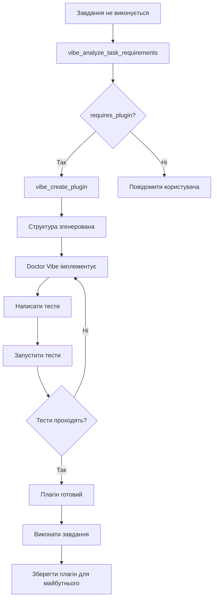

# Doctor Vibe Auto-Plugin System - Implementation Guide

## 📋 Огляд

Система **Doctor Vibe Extensions** дозволяє Doctor Vibe автоматично створювати спеціалізовані плагіни коли стандартні інструменти Trinity не можуть виконати завдання користувача.

## 🎯 Мета

Замість того, щоб повідомляти користувачу "це неможливо виконати з доступними інструментами", Doctor Vibe:
1. Аналізує що саме потрібно
2. Створює спеціалізований плагін
3. Імплементує необхідну логіку
4. Виконує завдання

## 🔧 Компоненти системи

### 1. `plugins/doctor_vibe_extensions/`

Основний плагін, який надає Doctor Vibe можливість створювати інші плагіни.

**Ключові інструменти:**

#### `vibe_analyze_task_requirements`
Аналізує чи потрібен спеціалізований плагін.

```python
result = vibe_analyze_task_requirements(
    task_description="Parse PDF invoices and save to database",
    failed_attempts=["read_file", "grep_search"]  # Optional
)

# Returns:
{
    "requires_plugin": True,
    "plugin_type": "file_format",
    "detected_types": ["file_format", "database"],
    "missing_capabilities": ["pdf", "database", "parse"],
    "suggested_tools": [
        {"name": "parse_file", "description": "Parse specialized file format"},
        {"name": "execute_query", "description": "Execute database query safely"}
    ],
    "confidence": 0.8,
    "standard_tools_failed": True
}
```

#### `vibe_create_plugin`
Створює структуру плагіна з шаблонним кодом.

```python
result = vibe_create_plugin(
    task_description="Create REST API client for Stripe payments",
    plugin_name="stripe_integration",  # Optional, auto-generated if not provided
    plugin_type="api"  # Optional, detected from task_description
)

# Returns:
{
    "status": "success",
    "plugin_name": "stripe_integration",
    "plugin_path": "/path/to/plugins/stripe_integration",
    "plugin_type": "api",
    "tools_generated": ["make_api_request", "parse_api_response"],
    "message": "✅ Doctor Vibe plugin 'stripe_integration' created successfully...",
    "next_steps": [
        "Doctor Vibe should implement tool functions in plugin.py",
        "Add error handling and validation",
        "Create unit tests",
        "Register plugin with Trinity to use tools"
    ]
}
```

### 2. Розпізнавані типи плагінів

| Тип | Ключові слова | Інструменти |
|-----|---------------|-------------|
| `api` | api, rest, graphql, endpoint, http request | make_api_request, parse_api_response |
| `database` | database, sql, query, table, mongodb, postgres | execute_query, fetch_records |
| `file_format` | pdf, excel, csv, json, xml, yaml, parse | parse_file, convert_format |
| `cloud` | aws, azure, gcp, s3, cloud | upload_to_cloud, download_from_cloud |
| `automation` | automate, workflow, pipeline, cron | create_workflow, schedule_task |
| `integration` | integrate, sync, webhook, oauth | sync_data, handle_webhook |
| `data_processing` | transform, filter, aggregate, analyze data | transform_data, aggregate_results |

## 🚀 Як Doctor Vibe використовує систему

### Сценарій 1: Автоматичне виявлення

```
Користувач: "Parse all PDF files in ./invoices and extract data to PostgreSQL"

Trinity:
1. Спробує read_file → провал (бінарний PDF)
2. Спробує grep_search → провал (не текстовий формат)

Doctor Vibe (автоматично):
1. Викликає vibe_analyze_task_requirements(
     task_description="Parse all PDF files in ./invoices and extract data to PostgreSQL",
     failed_attempts=["read_file", "grep_search"]
   )
   
2. Отримує requires_plugin=True, plugin_type="file_format"

3. Викликає vibe_create_plugin(
     task_description="...",
     plugin_type="file_format"
   )
   
4. Отримує згенеровану структуру:
   plugins/vibe_file_format_1734876543/
   ├── plugin.py (з заглушками parse_file, convert_format)
   ├── README.md
   └── tests/test_plugin.py

5. Відкриває plugin.py і імплементує:
   - parse_file(): використовує PyPDF2 для парсингу PDF
   - Додає логіку підключення до PostgreSQL
   - Пише тести

6. Плагін автоматично завантажується при наступному запуску Trinity

7. Виконує завдання за допомогою нових інструментів
```

### Сценарій 2: Явний запит

```
Користувач: "Створи плагін для роботи з Telegram Bot API"

Doctor Vibe:
1. Розпізнає keywords: "створи плагін" → DEV mode + plugin creation
2. Аналізує: "Telegram Bot API" → api type
3. Створює плагін з назвою "telegram_bot_api"
4. Генерує інструменти: send_message, receive_updates, set_webhook
5. Імплементує requests-based API client
6. Пише тести з mock responses
```

### Сценарій 3: Провал стандартних інструментів

```
Користувач: "Download all images from this S3 bucket and resize them"

Trinity:
1. Немає інструмента для S3 → провал
2. Немає інструмента для image resize → провал

Doctor Vibe:
1. Аналіз: потрібен cloud + data_processing плагін
2. Створює vibe_cloud_1734876600/
3. Імплементує boto3 integration для S3
4. Додає Pillow для resize
5. Створює pipeline tool: download_and_resize_images
6. Виконує завдання
```

## 🎓 Best Practices для Doctor Vibe

### 1. Завжди аналізуй перед створенням

```python
# GOOD
analysis = vibe_analyze_task_requirements(task_description, failed_attempts)
if analysis["requires_plugin"]:
    create_vibe_plugin(...)

# BAD - не перевіряй чи потрібен плагін
create_vibe_plugin(...)  # Можливо стандартні інструменти справились би
```

### 2. Надавай детальні описи завдань

```python
# GOOD
"Parse PDF invoices with OCR, extract line items with amounts, validate totals, and save to PostgreSQL with transaction handling"

# BAD
"Work with PDFs"
```

### 3. Імплементуй повністю

Згенерована структура містить заглушки. Doctor Vibe повинен:
- ✅ Написати реальну логіку в кожній функції
- ✅ Додати error handling
- ✅ Написати тести (мінімум 3-5 тестів)
- ✅ Додати документацію в docstrings
- ✅ Оновити README.md

### 4. Перевикористовуй існуючі плагіни

Перед створенням нового плагіна:
```python
# Перевір чи є схожий плагін
existing_plugins = list_existing_plugins()
similar = find_similar_plugins(task_description)
if similar:
    # Розшир існуючий плагін замість створення нового
```

### 5. Тестуй перед використанням

```python
# Після імплементації
run_plugin_tests(plugin_name)
# Якщо тести не проходять → виправ перед використанням
```

## 🔄 Життєвий цикл плагіна



## 📊 Статистика та метрики

Doctor Vibe Extensions відстежує:
- Скільки плагінів створено автоматично
- Які типи плагінів найчастіше потрібні
- Success rate створених плагінів
- Час від створення до готовності

## 🔐 Безпека

### Обов'язкові перевірки:

1. **Валідація вхідних даних** в кожному інструменті
2. **Не зберігай credentials в коді** (використовуй .env)
3. **Sandbox виконання** для невідомого коду
4. **Rate limiting** для API calls
5. **Логування всіх операцій** для аудиту

### Приклад безпечного інструмента:

```python
def make_api_request(url: str, method: str = "GET", **kwargs) -> Dict[str, Any]:
    """Make API request with safety checks."""
    
    # 1. Validate URL
    if not url.startswith(("https://", "http://")):
        return {"status": "error", "error": "Invalid URL scheme"}
    
    # 2. Rate limiting
    if not rate_limiter.check(url):
        return {"status": "error", "error": "Rate limit exceeded"}
    
    # 3. Timeout
    kwargs.setdefault("timeout", 30)
    
    # 4. Execute with error handling
    try:
        response = requests.request(method, url, **kwargs)
        response.raise_for_status()
        
        # 5. Log success
        logger.info(f"API request successful: {method} {url}")
        
        return {
            "status": "success",
            "status_code": response.status_code,
            "data": response.json()
        }
    except Exception as e:
        # 6. Log error
        logger.error(f"API request failed: {method} {url} - {e}")
        return {"status": "error", "error": str(e)}
```

## 🧪 Тестування

Кожен згенерований плагін повинен мати мінімум:

```python
# tests/test_plugin.py

def test_plugin_meta():
    """Test plugin metadata."""
    assert PLUGIN_META.name
    assert PLUGIN_META.version

def test_tool_success():
    """Test tool with valid input."""
    result = tool_function(valid_input)
    assert result["status"] == "success"

def test_tool_error_handling():
    """Test tool with invalid input."""
    result = tool_function(invalid_input)
    assert result["status"] == "error"
    assert "error" in result

def test_tool_edge_cases():
    """Test tool edge cases."""
    # Empty input
    # Very large input
    # Special characters
    # etc.
```

## 📚 Приклади

### Приклад 1: GitHub API Client

```python
# Користувач: "Автоматично створювати GitHub issues з помилок в логах"

# Doctor Vibe:
analysis = vibe_analyze_task_requirements(
    "Create GitHub issues from error logs automatically"
)
# → requires_plugin=True, plugin_type="api"

plugin = vibe_create_plugin(
    task_description="...",
    plugin_name="github_issue_creator"
)

# Імплементація в plugins/github_issue_creator/plugin.py:
def create_github_issue(title: str, body: str, labels: List[str] = None) -> Dict:
    """Create GitHub issue using API."""
    headers = {"Authorization": f"Bearer {os.getenv('GITHUB_TOKEN')}"}
    data = {"title": title, "body": body, "labels": labels or []}
    
    response = requests.post(
        "https://api.github.com/repos/owner/repo/issues",
        headers=headers,
        json=data
    )
    
    return {"status": "success", "issue_url": response.json()["html_url"]}
```

### Приклад 2: Excel Report Generator

```python
# Користувач: "Згенеруй Excel звіт з даними з бази даних"

# Doctor Vibe:
plugin = vibe_create_plugin(
    task_description="Generate Excel reports from database queries",
    plugin_type="file_format"
)

# Імплементація:
def generate_excel_report(query: str, output_file: str) -> Dict:
    """Generate Excel from SQL query."""
    import pandas as pd
    from sqlalchemy import create_engine
    
    engine = create_engine(os.getenv('DATABASE_URL'))
    df = pd.read_sql(query, engine)
    
    df.to_excel(output_file, index=False)
    
    return {"status": "success", "file": output_file, "rows": len(df)}
```

## 🎯 Висновок

Doctor Vibe Extensions перетворює Trinity з системи з фіксованим набором інструментів у **саморозширювану систему**, яка може адаптуватись до будь-яких завдань користувача.

**Ключова ідея**: Якщо завдання не може бути виконано - створи інструмент щоб виконати його!

---

**Версія**: 1.0.0  
**Дата**: 22 грудня 2025  
**Автор**: Trinity System
