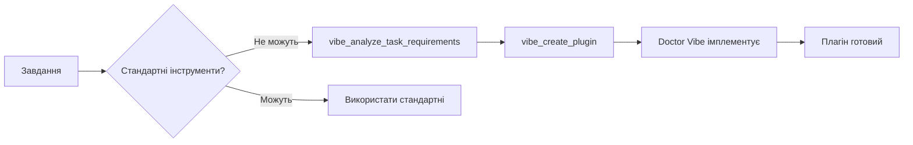

# Trinity Plugin Development Guide

## Огляд / Overview

Trinity має вбудовану систему плагінів, яка дозволяє автоматично створювати та розробляти розширення за допомогою Doctor Vibe workflow.

Trinity has a built-in plugin system that allows you to automatically create and develop extensions using the Doctor Vibe workflow.

---

## 🎯 Doctor Vibe Auto-Plugin System

**ВАЖЛИВО**: Doctor Vibe може **автоматично створювати плагіни** коли стандартні інструменти Trinity не можуть виконати завдання!

**IMPORTANT**: Doctor Vibe can **auto-generate plugins** when standard Trinity tools cannot accomplish a task!

### Коли Doctor Vibe створює плагін автоматично / When Doctor Vibe Auto-Creates Plugins

Doctor Vibe аналізує кожне завдання і автоматично створює спеціалізований плагін коли:

Doctor Vibe analyzes each task and automatically creates a specialized plugin when:

1. **Стандартні інструменти провалились** / Standard tools failed
2. **Потрібні API інтеграції** / API integrations needed (REST, GraphQL, webhooks)
3. **Спеціалізовані формати файлів** / Specialized file formats (PDF, Excel, complex CSV)
4. **База даних операції** / Database operations (SQL, MongoDB, etc.)
5. **Хмарні сервіси** / Cloud services (AWS, Azure, GCP)
6. **Автоматизація** / Automation (workflows, scheduling)
7. **Складна обробка даних** / Complex data processing

### Workflow автоматичного створення / Auto-Creation Workflow



Дивіться `plugins/doctor_vibe_extensions/` для деталей реалізації.

See `plugins/doctor_vibe_extensions/` for implementation details.

---

## Швидкий старт / Quick Start

### 1. Створення плагіна / Creating a Plugin

Просто попросіть Trinity створити плагін:

```
створи плагін для обробки CSV файлів
create plugin for CSV processing
```

Trinity автоматично:
- Створить структуру директорії в `plugins/`
- Згенерує шаблонний код
- Переключиться в DEV режим з Doctor Vibe
- Покаже diff preview перед кожною зміною файлу

Trinity will automatically:
- Create directory structure in `plugins/`
- Generate boilerplate code
- Switch to DEV mode with Doctor Vibe
- Show diff preview before each file change

### 2. Структура плагіна / Plugin Structure

```
plugins/
├── my_plugin_name/
│   ├── __init__.py          # Package initialization
│   ├── plugin.py            # Main plugin code (PLUGIN_META + register)
│   ├── README.md            # Documentation
│   └── tests/
│       └── test_plugin.py   # Unit tests
```

### 3. Приклад плагіна / Plugin Example

Дивіться `plugins/example_data_processor/` для повного прикладу.

See `plugins/example_data_processor/` for a complete example.

---

## Workflow створення / Creation Workflow

### Крок 1: Запит на створення
```
Ти: створи плагін для інтеграції з Telegram API
You: create plugin for Telegram API integration
```

### Крок 2: Автоматична генерація
Trinity створить:
```
plugins/telegram_api_integration/
├── __init__.py
├── plugin.py              # ← Редагуйте тут / Edit here
├── README.md
└── tests/
    └── test_plugin.py
```

### Крок 3: Doctor Vibe контроль
- ✅ TRINITY_DEV_BY_VIBE=1 увімкнено автоматично
- 🔍 Кожна зміна файлу показує diff preview
- ⏸️ Пауза перед записом (якщо TRINITY_VIBE_AUTO_APPLY=0)
- 🎯 Stack trace та контекст у TUI

### Крок 4: Розробка
Trinity допомагає з:
- Написанням коду плагіна
- Створенням тестів
- Документацією
- Інтеграцією з MCP registry

---

## Шаблон плагіна / Plugin Template

```python
"""My Plugin - Trinity System Plugin"""

from typing import Dict, Any
from plugins import PluginMeta

# Plugin metadata
PLUGIN_META = PluginMeta(
    name="My Plugin",
    version="0.1.0",
    description="Plugin description",
    author="Trinity System",
    dependencies=[]
)

def my_tool(arg: str) -> Dict[str, Any]:
    """Tool implementation."""
    try:
        # Your logic here
        return {
            "tool": "my_tool",
            "status": "success",
            "result": "..."
        }
    except Exception as e:
        return {
            "tool": "my_tool",
            "status": "error",
            "error": str(e)
        }

def register(registry) -> None:
    """Register plugin tools."""
    registry.register_tool(
        "my_tool",
        my_tool,
        description="Tool description. Args: arg (str)"
    )
```

---

## Змінні оточення / Environment Variables

### Doctor Vibe контроль:
- `TRINITY_DEV_BY_VIBE=1` - Doctor Vibe контролює всі DEV редагування (увімкнено автоматично)
- `TRINITY_VIBE_AUTO_APPLY=1` - Авто-застосування змін без паузи (опціонально)

### Plugin discovery:
- Плагіни автоматично знаходяться при старті Trinity
- Інструменти реєструються в MCP registry
- Доступні для всіх агентів (Atlas, Tetyana, Grisha)

---

## Тестування / Testing

### Запуск тестів плагіна:
```bash
pytest plugins/my_plugin_name/tests/ -v
```

### Запуск усіх тестів:
```bash
pytest -v
```

---

## Ключові особливості / Key Features

✅ **Автоматична реєстрація** - плагіни автоматично знаходяться та завантажуються  
✅ **Doctor Vibe інтеграція** - повний контроль над розробкою з diff preview  
✅ **Шаблонна генерація** - готова структура з тестами та документацією  
✅ **MCP сумісність** - інструменти доступні для всіх LLM агентів  
✅ **Ізоляція** - кожен плагін в окремій директорії  
✅ **Тестування** - автоматична генерація unit тестів  

---

## Приклади використання / Usage Examples

### Створення плагіна для аналізу логів:
```
створи плагін для аналізу та парсингу log файлів
create plugin for log file analysis and parsing
```

### Створення плагіна для роботи з API:
```
create plugin for GitHub API integration
створи плагін для інтеграції з GitHub API
```

### Створення плагіна для обробки даних:
```
create plugin for CSV data transformation
створи плагін для трансформації CSV даних
```

---

## Поради / Tips

1. **Назви плагінів**: Використовуйте описові назви (напр., "GitHub API Helper", "Log Analyzer")
2. **Опис**: Надайте чіткий опис при створенні — це допоможе Trinity краще зрозуміти призначення
3. **Тести**: Trinity автоматично створює шаблони тестів — розширюйте їх під час розробки
4. **Документація**: README.md генерується автоматично — додайте приклади використання
5. **Залежності**: Якщо потрібні external пакети, додайте `requirements.txt` у директорію плагіна

---

## Troubleshooting

### Плагін не знаходиться:
- Перевірте структуру: `plugins/plugin_name/plugin.py` має існувати
- Переконайтеся, що `PLUGIN_META` визначено
- Перезапустіть Trinity для повторного сканування

### Doctor Vibe не активується:
- Перевірте `TRINITY_DEV_BY_VIBE=1` у середовищі
- Переконайтеся, що запит містить ключові слова: "плагін", "plugin", "модуль", "module"

### Інструменти не реєструються:
- Перевірте, що `register(registry)` функція визначена
- Переконайтеся, що немає помилок у `plugin.py`
- Подивіться логи запуску Trinity для повідомлень про помилки

---

## Додаткова інформація / Additional Info

📖 Дивіться `plugins/README.md` для детальної технічної документації  
📖 See `plugins/README.md` for detailed technical documentation  

🔧 Приклад: `plugins/example_data_processor/`  
🔧 Example: `plugins/example_data_processor/`

💡 Питання? Попросіть Trinity показати приклади або створити тестовий плагін!  
💡 Questions? Ask Trinity to show examples or create a test plugin!
