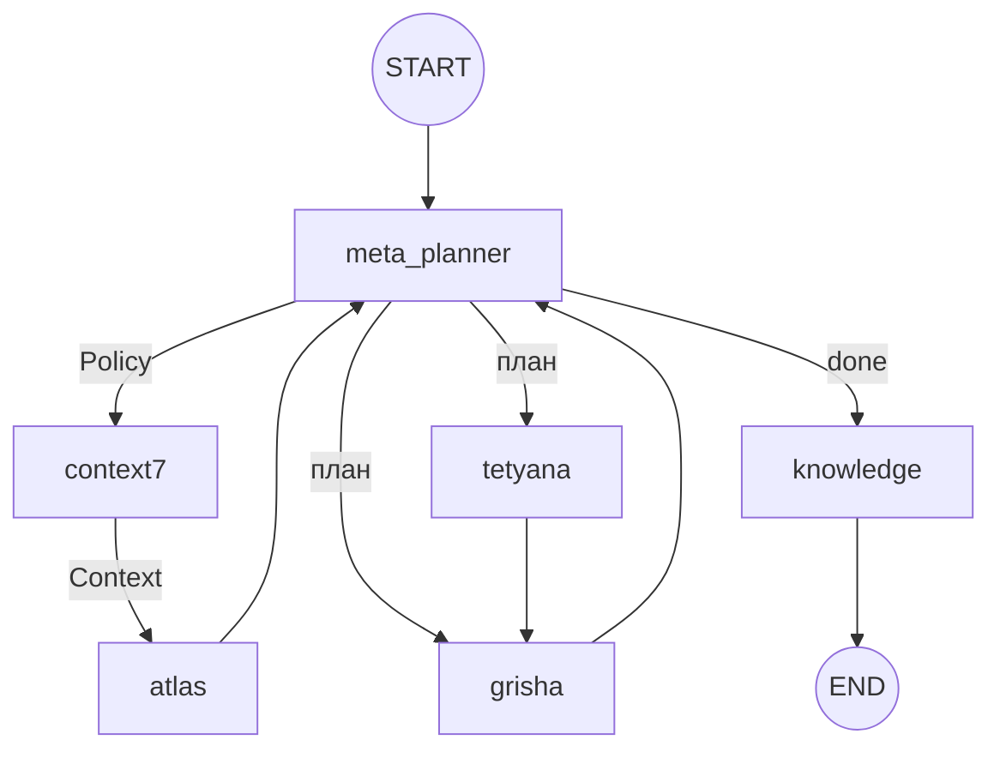

# Project Atlas Workflow Guide
**Cognitive 2.1 + Trinity Improvements v1.0 | Грудень 2025**

## 1. Core Principles

Atlas — **автономний мультиагентний оператор macOS**:

1. **Autonomous Navigation** — Цикл "Сприйняття → Планування → Дія → Верифікація"
2. **Meta-Planning 2.0** — Агент керує стратегією, рівнем верифікації. Pydantic валідація.
3. **Vision-First** — Скріншоти та CV як Ground Truth (multi-monitor, diff аналіз)
4. **Privacy & Stealth** — Очищення слідів, підміна ідентифікаторів
5. **Continuous Learning 2.0** — Knowledge Base з confidence score
6. **State Logging** — Логи: `logs/trinity_state_*.log`

---

## 2. Trinity Runtime (LangGraph)



### Agents

| Agent | Role |
|:---|:---|
| **Meta-Planner** | Orchestrator. Active Retrieval, фільтрація спогадів |
| **Context7** | Context Manager. Token budget, sliding window |
| **Atlas** | Architect. Тактичний план |
| **Tetyana** | Executor. Native/GUI/Playwright |
| **Grisha** | Verifier. `enhanced_vision_analysis` |
| **Knowledge** | Learner. Рефлексія, збереження досвіду |

---

## 3. Core Components

### 3.1 Hierarchical Memory (`core/memory.py`)

| Layer | Duration | Purpose |
|:---|:---|:---|
| Working | Session | Активний контекст |
| Episodic | Multi-session | Конкретні події |
| Semantic | Permanent | Консолідовані знання |

```python
memory = HierarchicalMemory()
memory.add_to_working("task", {...})
memory.consolidate_to_semantic()
```

### 3.2 Context7 (`core/context7.py`)
- Token Budget, Priority Weighting, ContextMetrics

### 3.3 Agent Protocol (`core/agent_protocol.py`)
- AgentMessage, PriorityMessageQueue, MessageRouter

### 3.4 Parallel Executor (`core/parallel_executor.py`)
- DependencyAnalyzer, Thread Pool

---

## 4. Vision Pipeline

### DifferentialVisionAnalyzer
- `capture_all_monitors()` — Multi-monitor
- `analyze_frame()` — Diff + OCR
- `_generate_diff_image()` — Візуалізація

### VisionContextManager
- Trend Detection, Active Region Tracking, Frame History

```python
result = EnhancedVisionTools.capture_and_analyze(multi_monitor=True)
context_manager.update_context(result)
```

---

## 5. Meta-Planning 2.0

| Parameter | Values |
|:---|:---|
| **Strategy** | `linear`, `rag_heavy`, `aggressive` |
| **Active Retrieval** | Оптимізований `retrieval_query` |
| **Anti-patterns** | Уникнення `status: failed` |
| **Confidence** | `0.1...1.0` |

---

## 6. MCP Foundation

### Internal
- **Automation**: Shell, AppleScript, Shortcuts, Mouse/KB
- **Cleanup**: Stealth Mode, spoof
- **Vision**: `enhanced_vision_analysis`, `compare_images`

### External MCP
- **Playwright**: Browser control
- **PyAutoGUI**: Input emulation
- **Context7**: Library docs
- **SonarQube**: Code analysis

---

## 7. TUI & Themes

**14 themes**: monaco, dracula, nord, gruvbox, catppuccin, tokyo-night, one-dark, rose-pine, cyberpunk, aurora, midnight-blue, solarized-dark, hacker-vibe

**Keys**: `Ctrl+T` change, `Settings → Appearance`

---

## 8. Trinity Improvements v1.0

### Pydantic Validation
```python
from core.trinity_models import TrinityStateModel
state = TrinityStateModel(current_agent="meta_planner")
state.validate_state()
```

### MyPy + Tests
```bash
mypy core/ --config-file=setup.cfg
pytest tests/test_trinity_models.py -v
```

---

## 9. Quick Start

```bash
./setup.sh              # Install
./cli.sh                # Run TUI
/trinity <task>         # Start
/autopilot <task>       # Autonomous
```

---

## 10. Project Structure

📋 `project_structure_final.txt` — Auto-generated on commit

### Logs
| Location | Content |
|:---|:---|
| `logs/trinity_state_*.log` | Trinity logs |
| `.last_response.txt` | Last response |
| `task_logs/` | Task logs |

```bash
./regenerate_structure.sh
cat .last_response.txt
```

---

## 11. Editor Integration

### Windsurf, Copilot, VS Code
- **Windsurf**: `~/Library/Application Support/Windsurf/logs/`
- **VS Code**: `~/Library/Application Support/Code/logs/`

### State Logger
```python
from core.state_logger import StateInitLogger
StateInitLogger().log_initial_state("Task", state_dict)
```

---

## 12. Advanced

### Self-Healing
1. Detection (Grisha) → 2. Correction → 3. Strategy Shift → 4. Limits

### Dev Mode
- Code editing, shell execution, unsafe tools

### Interactive
- User ↔ Agent via TUI, `[VOICE]` messages

---

*Updated: December 20, 2025*
