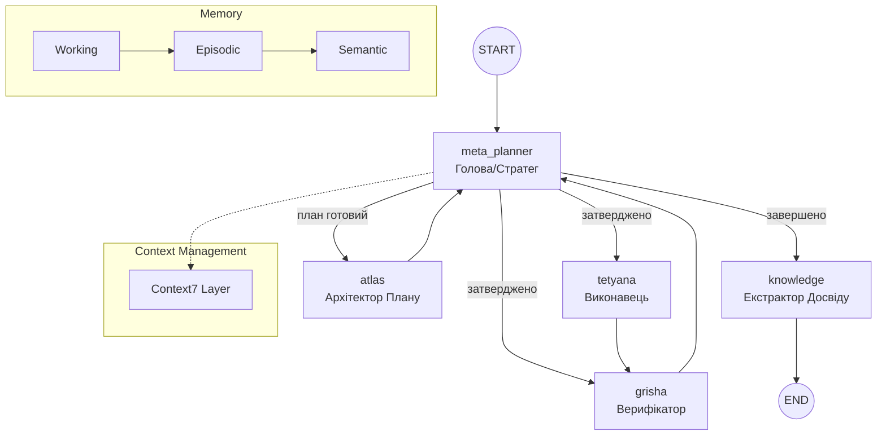

# Project Atlas Workflow Guide
**Cognitive 2.1 + Trinity Improvements v1.1 | Грудень 2025**

Єдине джерело правди про фундаментальні принципи роботи системи Atlas (Trinity Runtime).

---

## 1. Core Principles

Atlas — **автономний мультиагентний оператор macOS**, що керується наступними принципами:

1. **Autonomous Navigation** — Здатність самостійно приймати рішення в умовах невизначеності. Цикл "Сприйняття → Планування → Дія → Верифікація".

2. **Meta-Planning 2.0** — Агент керує власною стратегією: обирає рівень верифікації, режим відновлення та тип плану. Pydantic валідація конфігурації.

3. **Vision-First** — Використання скріншотів та Computer Vision як Ground Truth. Підтримка multi-monitor та диференційного аналізу.

4. **Privacy & Stealth** — Система очищення слідів та підміна ідентифікаторів (`spoofing`).

5. **Continuous Learning 2.0** — Система витягує досвід (успішний та негативний) та зберігає його у Knowledge Base з оцінкою впевненості.

6. **State Logging & Resilience** — Деталізовані логи переходів агентів (`logs/trinity_state_*.log`) та автоматичне відновлення LLM запитів (Retries/Timeouts).

---

## 2. Trinity Runtime Architecture (LangGraph)

Центральна нервова система Atlas базується на циклічному графі. Будь-яка успішна місія проходить через вузол навчання.



### Trinity Agents & Layers

| Agent | Role | Description |
|:---|:---|:---|
| **Meta-Planner** | Orchestrator | Головний оркестратор. Active Retrieval та фільтрація спогадів |
| **Context7** | Context Manager | Token budget, sliding window з пріоритезацією недавніх кроків |
| **Atlas** | Architect | Тактичний план на основі нормалізованого контексту |
| **Tetyana** | Executor | Виконавець (Native/GUI/Playwright) |
| **Grisha** | Verifier | Верифікатор з `enhanced_vision_analysis`. Вимагає доказів (evidence) від Тетяни для підтвердження. |
| **Knowledge** | Learner | Етап рефлексії. Зберігає досвід (`success`/`failed`) та оновлює Knowledge Base. |

---

## 3. Core Components

### 3.1 Hierarchical Memory System (`core/memory.py`)

Трирівнева система пам'яті:

| Layer | Duration | Purpose |
|:---|:---|:---|
| **Working Memory** | Поточна сесія | Тимчасові дані, активний контекст |
| **Episodic Memory** | Декілька сесій | Конкретні події, взаємодії |
| **Semantic Memory** | Постійно | Консолідовані знання, патерни |

```python
memory = HierarchicalMemory()
memory.add_to_working("current_task", {...})
memory.consolidate_to_semantic()  # Promote knowledge
```

### 3.2 Context7 Sliding Window (`core/context7.py`)

Оптимізований менеджер контексту:
- **Token Budget**: Динамічне керування бюджетом токенів
- **Priority Weighting**: Пріоритезація недавніх кроків та критичної інформації
- **ContextMetrics**: Відстеження використання токенів

### 3.3 Agent Message Protocol (`core/agent_protocol.py`) - Subsystem
Модуль для структурованої чергової комунікації. Наразі доступний як бібліотека для складних розширень, але не є обов'язковим для базового циклу Trinity.

### 3.4 Parallel Tool Executor (`core/parallel_executor.py`) - Subsystem
Двигун для паралельного виконання незалежних кроків. Використовується для RAG-запитів та пакетних операцій.

### 3.5 MCP Prompt Engine (`mcp_integration/prompt_engine.py`)
Динамічний рушій контексту, що працює на базі ChromaDB:
- **Large-Scale Ingestion**: Підтримка рекурсивної індексації репозиторіїв (Fabric, LangGPT).
- **Active Retrieval**: Пошук "найкращих практик" та "експертних промптів" перед виконанням.
- **Automatic Injection**: Прозоре додавання інструкцій до контексту агента (Tetyana/Atlas).

---

## 4. Vision Pipeline (Enhanced)

### 4.1 DifferentialVisionAnalyzer (`system_ai/tools/vision.py`)

| Function | Description |
|:---|:---|
| `capture_all_monitors()` | Multi-monitor screenshot через Quartz/mss |
| `analyze_frame()` | Диференційний аналіз + OCR |
| `_generate_diff_image()` | Візуалізація змінених регіонів |

### 4.2 VisionContextManager (`core/vision_context.py`)

- **Trend Detection**: Відстеження тренду змін (increasing/decreasing/stable)
- **Active Region Tracking**: Hot zones з частими змінами
- **Frame History**: До 10 кадрів з метаданими
- **Step Verification**: `get_diff_summary_for_step()` для верифікації дій

```python
result = EnhancedVisionTools.capture_and_analyze(
    multi_monitor=True,
    generate_diff_image=True
)
context_manager.update_context(result)
```

---

## 5. Meta-Planning 2.0

| Parameter | Values | Description |
|:---|:---|:---|
| **Strategy** | `linear`, `rag_heavy`, `aggressive` | Тип побудови плану |
| **Active Retrieval** | `retrieval_query` | Оптимізований запит Meta-Planner |
| **Anti-patterns** | `status: failed` | Уникнення провалених стратегій |
| **Fail Escalation** | `fail_count >= 4` | Автоматичне перепланування при повторних невдачах верифікації |
| **Confidence Score** | `0.1...1.0` | Оцінка надійності на основі правок |
| **Source Tracking** | `trinity_runtime`, `user` | Походження знання |

---

## 6. MCP Foundation (Інструменти)

### Internal Tools
- **Automation (Unified)**: Shell, AppleScript, Shortcuts, Mouse/Keyboard
- **System Cleanup**: Очищення слідів, логів, спуфінг (Stealth Mode)
- **Recorder Control**: Програмне керування записом сесій
- **Desktop/Vision**: `enhanced_vision_analysis`, `compare_images`

### External MCP Servers
- **Playwright MCP**: Повний контроль браузера (headless/headful)
- **PyAutoGUI MCP**: Альтернативна емуляція вводу
- **AppleScript MCP**: Low-level UI automation for macOS
- **Anthropic MCP**: Complex text/code generation delegator
- **Context7 MCP**: Доступ до документації бібліотек
- **SonarQube MCP**: Quality gate та аналіз коду

### Dual MCP Client Support
Система підтримує два незалежних клієнти з можливістю автоматичного перемикання (`AUTO` mode):
- **Open-MCP (LangGraph)**: Основний клієнт для складних агентних сценаріїв.
- **Continue MCP (CLI)**: Оптимізований клієнт для розробки та локальних операцій з файлами.

---

## 7. TUI & Themes

**14 тем у 4 категоріях:**

| Category | Themes |
|:---|:---|
| **Classic** | monaco, dracula, nord, gruvbox |
| **Modern** | catppuccin, tokyo-night, one-dark, rose-pine |
| **Vibrant** | cyberpunk, aurora, midnight-blue, solarized-dark |
| **Special** | hacker-vibe (dimmed) |

**Навігація**: `Ctrl+T` швидка зміна теми, `Settings → Appearance` вибір з превʼю

---

## 8. Trinity Improvements v1.0 (Грудень 2025)

### 8.1 Pydantic State Validation
```python
from core.trinity_models import TrinityStateModel, MetaConfig

state = TrinityStateModel(
    current_agent="meta_planner",
    task_type="GENERAL",
    meta_config=MetaConfig(strategy="hybrid")
)
state.validate_state()  # ✅ Повна валідація схеми
```

### 8.2 MyPy Type Checking
```bash
mypy core/trinity.py --config-file=setup.cfg
```

### 8.3 State Initialization Logging
- Деталізовані логи переходів агентів
- Місце: `logs/trinity_state_*.log`

### 8.4 Unit Testing
- 16 тестів для Pydantic моделей (100% coverage)
- Запуск: `pytest tests/test_trinity_models.py -v`

---

## 9. Quick Start

```bash
# Вимоги: Python 3.11+ (рекомендовано) або 3.12
./setup.sh                  # Встановлення залежностей
./cli.sh                    # Запуск TUI
/trinity <завдання>         # Запуск Trinity
/autopilot <завдання>       # Режим повної автономії

# Перевірка якості коду
pytest tests/test_trinity_models.py -v
mypy core/ --config-file=setup.cfg
```

---

## 10. Project Structure & Logs

📋 **Auto-generated**: `project_structure_final.txt` — оновлюється на кожен commit

### Log Locations

| Location | Content |
|:---|:---|
| `logs/trinity_state_*.log` | Детальні логи Trinity |
| `.last_response.txt` | Остання відповідь агента |
| `task_logs/` | Лог-файли завдань |
| `~/Library/.../Windsurf/logs/` | Логи Windsurf |

```bash
./regenerate_structure.sh           # Ручне оновлення
cat .last_response.txt              # Остання відповідь
tail -f logs/trinity_state_*.log    # Логи Trinity
```

---

## 11. Editor Integration

### Windsurf, Copilot, VS Code
- **Windsurf**: `~/Library/Application Support/Windsurf/logs/`
- **VS Code**: `~/Library/Application Support/Code/logs/`

### State Logger
```python
from core.state_logger import StateInitLogger
StateInitLogger().log_initial_state("Завдання", state_dict)
# Логи: logs/trinity_state_YYYYMMDD.log
```

---

## 12. Advanced Capabilities

### Self-Healing
1. **Detection**: Grisha аналізує результат кожного кроку
2. **Correction**: Replanning Loop при помилках
3. **Strategy Shift**: Перехід Native → GUI при необхідності
4. **Limits**: `MAX_REPLANS` для уникнення нескінченних циклів

### Dev Mode
- **Direct Code Editing**: Через `multi_replace_file_content`
- **Shell Execution**: `git`, `npm`, `python` та інші
- **Unsafe Tools**: AppleScript, Mouse Control (з підтвердженням)

### Інтерактивність
- **User → Agent**: Команди/уточнення через TUI
- **Agent → User**: Тег `[VOICE]` для повідомлень
- **Feedback Loop**: Прийом даних під час пауз

---

*Останнє оновлення: 23 грудня 2025 р. - Trinity Improved + MCP Engine*
