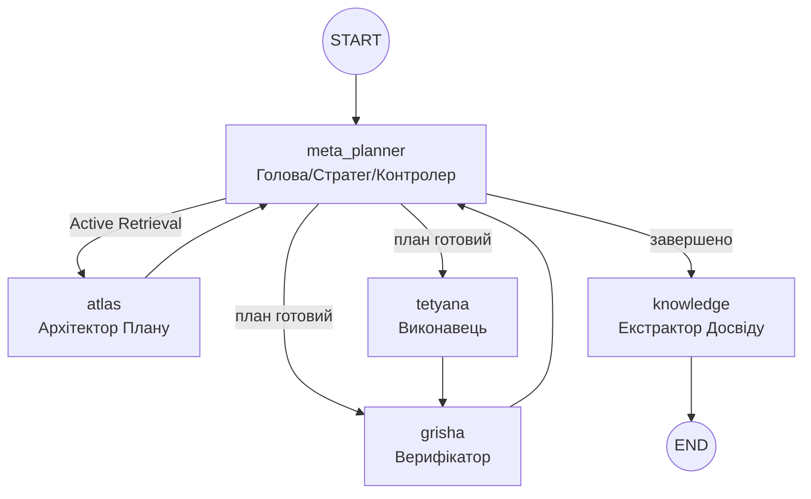

# Project Atlas: Архітектура, Workflow та Основні Принципи  
**Актуальний стан на грудень 2025 року (Cognitive 2.0)**

Цей документ є **єдиним джерелом правди** про фундаментальні принципи роботи системи Atlas (Trinity Runtime).

---

## 1. Основні принципи роботи (Core Principles)

Atlas — це не просто автоматизатор, а **автономний мультиагентний оператор macOS**, що керується наступними принципами:

1.  **Автономна Навігація (Autonomous Navigation)**  
    Здатність самостійно приймати рішення в умовах невизначеності, використовуючи цикл "Сприйняття → Планування → Дія → Верифікація".
2.  **Управління Мисленням (Meta-Planning)**  
    Агент керує власною стратегією: обирає рівень верифікації, режим відновлення та тип плану.
3.  **Візуальне Сприйняття (Vision-First)**  
    Використання скріншотів та Computer Vision як Ground Truth.
4.  **Конфіденційність та Стелс-режим (Privacy & Stealth)**  
    Система очищення слідів та підміна ідентифікаторів (`spoofing`).
5.  **Постійне Навчання (Continuous Learning 2.0)**  
    Система витягує досвід (як успішний, так і негативний) та зберігає його у **Knowledge Base** з оцінкою впевненості та статусом.

---

## 2. Архітектура Trinity Runtime (LangGraph)

Центральна нервова система Atlas базується на циклічному графі. Будь-яка успішна чи завершена місія обов'язково проходить через вузол навчання.



### 2.1 Trinity Agents

-   **Meta-Planner** (`_meta_planner_node`): Головний оркестратор. Виконує **Active Retrieval** та фільтрує спогади (пріоритезує успіхи, враховує анти-патерни).
-   **Atlas** (`_atlas_node`): Архітектор тактичного плану. Отримує повний список доступних інструментів динамічно та використовує контекст від Meta-Planner для формування кроків.
-   **Tetyana** (`_tetyana_node`): Виконавець (Native/GUI/Playwright).
-   **Grisha** (`_grisha_node`): Верифікатор. У разі успіху або критичного провалу ініціює перехід до навчання.
-   **Knowledge** (`_knowledge_node`): **Етап рефлексії**. Зберігає досвід (`success`/`failed`), додаючи метадані про джерело (`source`) та впевненість (`confidence`).

---

## 3. Мета-планінг та Пам'ять (Meta-planning 2.0)

| Параметр | Значення | Опис |
| :--- | :--- | :--- |
| **Strategy** | `linear`, `rag_heavy`, `aggressive` | Тип побудови плану. |
| **Active Retrieval** | `retrieval_query` | Оптимізований запит, сформований Meta-Planner. |
| **Anti-patterns** | `status: failed` | Система уникає стратегій, які призвели до помилок у минулому. |
| **Confidence Score** | `0.1` ... `1.0` | Оцінка надійності спогаду на основі кількості правок та кроків. |
| **Source Tracking** | `trinity_runtime`, `user` | Відстеження походження знання. |

---

## 4. MCP Фондація (Інструменти)

Центральний реєстр `MCPToolRegistry` надає агентам доступ до:

### Внутрішні Інструменти (Internal)
-   **Automation (Unified)**: Уніфікований модуль для Shell, AppleScript, Shortcuts та вводу (миша/клавіатура).
-   **System Cleanup**: Інструменти для очищення слідів, логів та спуфінгу (Stealth Mode).
-   **Recorder Control**: Програмне керування записом сесій (Start/Stop/Status).
-   **Desktop/Vision**: Аналіз екрану, пошук зображень, OCR.

### Зовнішні MCP Сервери (External)
-   **Playwright MCP**: Повний контроль браузера (headless/headful).
-   **PyAutoGUI MCP**: Альтернативна емуляція вводу (якщо внутрішня недоступна).


---

## 5. Додаткові можливості та Інтеграції (Extensions)

### 5.1 AI-IDE Integrations
-   **Windsurf**, **Antigravity**, **Cursor**: Спеціальні профілі для розробки.

### 5.2 Cleanup & Privacy System
-   Очищення `IndexedDB`, `keychain`, локальних сховищ ШІ.
-   **Spoofing**: MAC, hostname (з авто-ревертом через 4 години).

---

## 6. Система моніторингу та Трейси (Monitoring)

| Event | Опис |
| :--- | :--- |
| `trinity_run_start` | Початок виконання всього графа. |
| `knowledge_stored` | Подія збереження досвіду (статус, впевненість, джерело). |
| `atlas_plan_generated` | Подія створення нового плану. |
| `grisha_decision` | Вердикт верифікатора. |

---

## 7. Швидкий старт

```bash
./cli.sh                    # Запуск TUI
/trinity <завдання>         # Запуск Trinity
/autopilot <завдання>       # Режим повної автономії
```

---

*Останнє оновлення: 19 грудня 2025*
