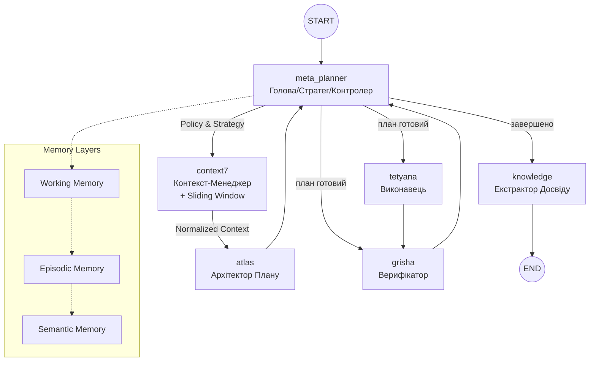

# Project Atlas: Архітектура, Workflow та Основні Принципи  
**Актуальний стан на грудень 2025 року (Cognitive 2.1)**

Цей документ є **єдиним джерелом правди** про фундаментальні принципи роботи системи Atlas (Trinity Runtime).

---

## 1. Основні принципи роботи (Core Principles)

Atlas — це не просто автоматизатор, а **автономний мультиагентний оператор macOS**, що керується наступними принципами:

1.  **Автономна Навігація (Autonomous Navigation)**  
    Здатність самостійно приймати рішення в умовах невизначеності, використовуючи цикл "Сприйняття → Планування → Дія → Верифікація".
2.  **Управління Мисленням (Meta-Planning)**  
    Агент керує власною стратегією: обирає рівень верифікації, режим відновлення та тип плану.
3.  **Візуальне Сприйняття (Vision-First)**  
    Використання скріншотів та Computer Vision як Ground Truth. Підтримка multi-monitor та диференційного аналізу.
4.  **Конфіденційність та Стелс-режим (Privacy & Stealth)**  
    Система очищення слідів та підміна ідентифікаторів (`spoofing`).
5.  **Постійне Навчання (Continuous Learning 2.0)**  
    Система витягує досвід (як успішний, так і негативний) та зберігає його у **Knowledge Base** з оцінкою впевненості та статусом.

---

## 2. Архітектура Trinity Runtime (LangGraph)

Центральна нервова система Atlas базується на циклічному графі. Будь-яка успішна чи завершена місія обов'язково проходить через вузол навчання.



### 2.1 Trinity Agents & Layers

-   **Meta-Planner** (`_meta_planner_node`): Головний оркестратор. Виконує **Active Retrieval** та фільтрує спогади.
-   **Context7** (`context7`): **Explicit Context Manager**. Готує контекст, керує бюджетом токенів та ін'єктує стратегічні політики. **Новинка**: Sliding Window з пріоритезацією недавніх кроків.
-   **Atlas** (`_atlas_node`): Архітектор тактичного плану. Отримує *нормалізований* контекст від Context7 для розробки кроків.
-   **Tetyana** (`_tetyana_node`): Виконавець (Native/GUI/Playwright).
-   **Grisha** (`_grisha_node`): Верифікатор. У разі успіху або критичного провалу ініціює перехід до навчання. Використовує `enhanced_vision_analysis` для візуальної верифікації.
-   **Knowledge** (`_knowledge_node`): **Етап рефлексії**. Зберігає досвід (`success`/`failed`).

---

## 3. Ключові Підсистеми (Core Components)

### 3.1 Hierarchical Memory System

Трирівнева система пам'яті (`core/memory.py`):

| Шар | Тривалість | Призначення |
|:---|:---|:---|
| **Working Memory** | Поточна сесія | Тимчасові дані, активний контекст |
| **Episodic Memory** | Декілька сесій | Конкретні події, взаємодії, результати |
| **Semantic Memory** | Постійно | Консолідовані знання, патерни, стратегії |

```python
memory = HierarchicalMemory()
memory.add_to_working("current_task", {...})
memory.consolidate_to_semantic()  # Promote important knowledge
```

### 3.2 Context7 Sliding Window

Оптимізований менеджер контексту (`core/context7.py`):

- **Token Budget**: Динамічне керування бюджетом токенів
- **Priority Weighting**: Пріоритезація недавніх кроків та критичної інформації
- **ContextMetrics**: Відстеження використання токенів

### 3.3 Agent Message Protocol

Структурована комунікація між агентами (`core/agent_protocol.py`):

- **AgentMessage**: Типізовані повідомлення з метаданими
- **PriorityMessageQueue**: Черга з пріоритетами
- **MessageRouter**: Маршрутизація та доставка

### 3.4 Parallel Tool Executor

Паралельне виконання незалежних кроків (`core/parallel_executor.py`):

- **DependencyAnalyzer**: Аналіз залежностей між кроками
- **Thread Pool**: Паралельне виконання незалежних операцій
- **StepResult**: Відстеження статусу та метрик

---

## 4. Vision Pipeline (Enhanced)

Розширена система візуального аналізу (`system_ai/tools/vision.py`, `core/vision_context.py`):

### 4.1 DifferentialVisionAnalyzer

| Функція | Опис |
|:---|:---|
| `capture_all_monitors()` | Multi-monitor screenshot через Quartz/mss |
| `analyze_frame()` | Диференційний аналіз + OCR |
| `_generate_diff_image()` | Візуалізація змінених регіонів |

### 4.2 VisionContextManager

- **Trend Detection**: Відстеження тренду змін (increasing/decreasing/stable)
- **Active Region Tracking**: Hot zones з частими змінами
- **Frame History**: До 10 кадрів з метаданими
- **Step Verification**: `get_diff_summary_for_step()` для верифікації дій

```python
# Використання агентами
result = EnhancedVisionTools.capture_and_analyze(
    multi_monitor=True,
    generate_diff_image=True
)
context_manager.update_context(result)
```

---

## 5. Мета-планінг та Пам'ять (Meta-planning 2.0)

| Параметр | Значення | Опис |
| :--- | :--- | :--- |
| **Strategy** | `linear`, `rag_heavy`, `aggressive` | Тип побудови плану. |
| **Active Retrieval** | `retrieval_query` | Оптимізований запит, сформований Meta-Planner. |
| **Anti-patterns** | `status: failed` | Система уникає стратегій, які призвели до помилок у минулому. |
| **Confidence Score** | `0.1` ... `1.0` | Оцінка надійності спогаду на основі кількості правок та кроків. |
| **Source Tracking** | `trinity_runtime`, `user` | Відстеження походження знання. |

---

## 6. MCP Фондація (Інструменти)

Центральний реєстр `MCPToolRegistry` надає агентам доступ до:

### Внутрішні Інструменти (Internal)
-   **Automation (Unified)**: Shell, AppleScript, Shortcuts, Mouse/Keyboard
-   **System Cleanup**: Очищення слідів, логів, спуфінг (Stealth Mode)
-   **Recorder Control**: Програмне керування записом сесій
-   **Desktop/Vision**: `enhanced_vision_analysis`, `vision_analysis_with_context`, `compare_images`

### Зовнішні MCP Сервери (External)
-   **Playwright MCP**: Повний контроль браузера (headless/headful)
-   **PyAutoGUI MCP**: Альтернативна емуляція вводу
-   **Context7 MCP**: Доступ до документації бібліотек
-   **SonarQube MCP**: Quality gate та аналіз коду

---

## 7. TUI та Теми

### 7.1 Доступні теми (14 тем)

| Категорія | Теми |
|:---|:---|
| **Classic** | monaco, dracula, nord, gruvbox |
| **Modern** | catppuccin, tokyo-night, one-dark, rose-pine |
| **Vibrant** | cyberpunk, aurora, midnight-blue, solarized-dark |
| **Special** | hacker-vibe (dimmed) |

### 7.2 Навігація TUI
- **Ctrl+T**: Швидка зміна теми
- **Settings → Appearance**: Вибір теми з превʼю
- **Custom themes**: `~/.system_cli/themes/*.json`

---

## 8. Швидкий старт

```bash
# Вимоги: Python 3.11 (рекомендовано) або 3.12
./setup.sh                  # Встановлення залежностей
./cli.sh                    # Запуск TUI
/trinity <завдання>         # Запуск Trinity
/autopilot <завдання>       # Режим повної автономії
```

---

## 9. FAQ & Advanced Capabilities

### 9.1 Режим Розробника (Dev Mode)
Atlas може працювати в розширеному режимі:
-   **Direct Code Editing**: Через `multi_replace_file_content`
-   **Shell Execution**: `git`, `npm`, `python` та інші
-   **Unsafe Tools**: AppleScript, Mouse Control (з підтвердженням)

### 9.2 Self-Healing
1.  **Detection**: Grisha аналізує результат кожного кроку
2.  **Correction**: Replanning Loop при помилках
3.  **Strategy Shift**: Перехід Native → GUI при необхідності
4.  **Limits**: `MAX_REPLANS` для уникнення нескінченних циклів

### 9.3 Інтерактивність
-   **User → Agent**: Команди/уточнення через TUI
-   **Agent → User**: Тег `[VOICE]` для повідомлень
-   **Feedback Loop**: Прийом даних під час пауз

---

## 10. Файлова структура ключових компонентів

```
core/
├── trinity.py          # Trinity Runtime (LangGraph)
├── context7.py         # Context Manager + Sliding Window
├── memory.py           # Hierarchical Memory (Working/Episodic/Semantic)
├── agent_protocol.py   # Agent Message Protocol
├── parallel_executor.py # Parallel Tool Execution
├── vision_context.py   # Vision Context Manager
└── mcp.py             # MCP Tool Registry

system_ai/tools/
├── vision.py          # DifferentialVisionAnalyzer, EnhancedVisionTools
└── screenshot.py      # Screenshot utilities

tui/
├── cli.py            # Main TUI application
├── themes.py         # 14 color themes
├── menu.py           # Menu system
└── keybindings.py    # Keyboard shortcuts
```

---

*Останнє оновлення: 20 грудня 2025*
