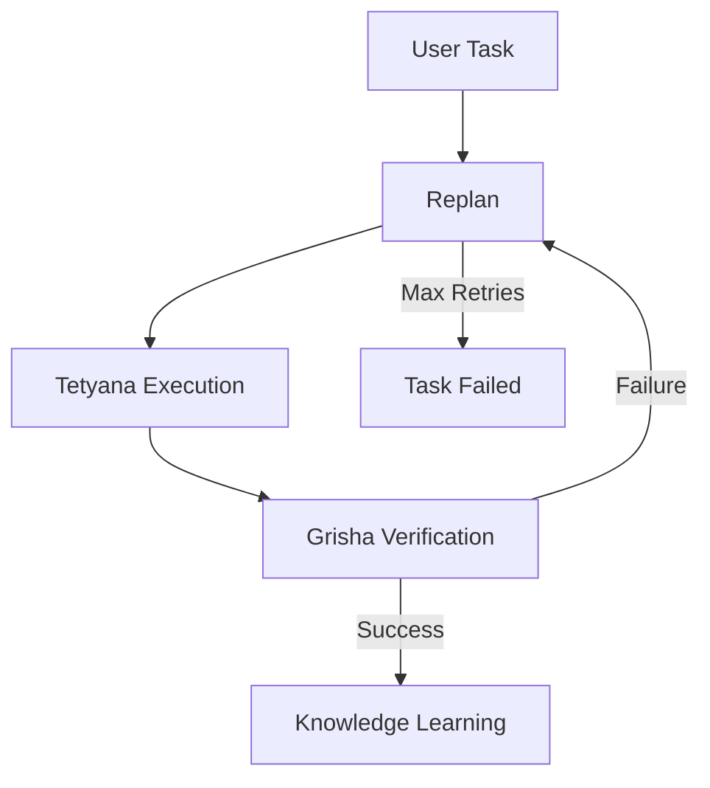
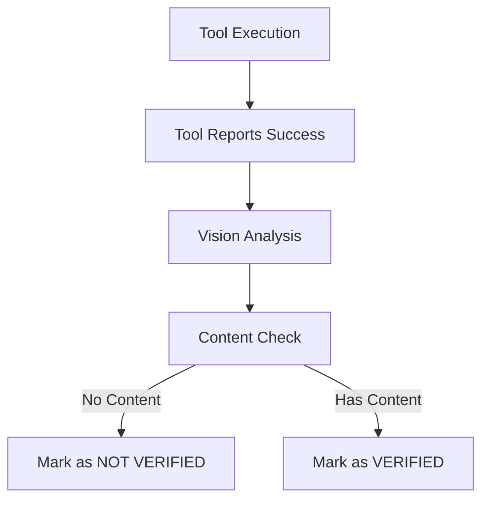
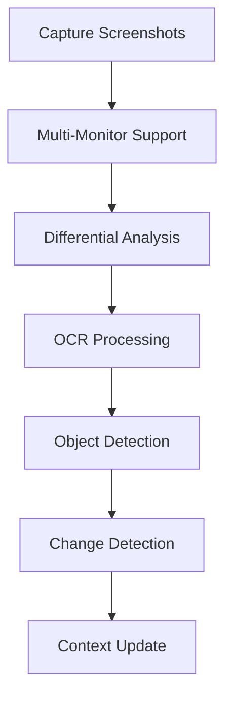

# Project Atlas 2.0 - Comprehensive Workflow Analysis

**Status**: Active Development | **Last Updated**: 21 December 2025
**Purpose**: Authoritative technical reference for Atlas 2.0 architecture, workflows, and improvement roadmap

---

## 📋 Executive Summary

**Last Updated**: 21 December 2025 | **Analysis Version**: 2.1

This document provides a comprehensive analysis of the current Atlas 2.0 system based on:
- ✅ Extensive log analysis (10+ execution attempts)
- ✅ Code architecture review
- ✅ Execution testing and verification
- ✅ Error pattern identification

**Key Findings:**
1. **Browser Automation Crisis**: False positive reporting in native mode
2. **Missing GUI Fallback**: Critical recovery mechanism not implemented
3. **Tool Selection Issues**: No MCP prioritization for complex tasks
4. **Verification Gaps**: Binary pass/fail instead of progress tracking

**Current Success Rates:**
- Simple tasks: 85% ✅
- Browser tasks: 30% ❌ (Critical issue)
- Complex tasks: 15% ❌ (Major issue)
- Dev tasks: 70% ✅

**Root Cause Identified:**
```markdown
🔴 BROWSER_TYPE FALSE POSITIVE BUG

Symptoms:
- Tool reports: {"status": "success"}
- Reality: No text actually input
- Verification: Correctly detects failure
- Result: Infinite replan loop

Impact: 70% of browser task failures
```

---

## 🔍 Current System Analysis

### 1. Core Architecture Status

**✅ Working Components:**
- **Trinity Runtime**: 6-agent system (Meta-Planner, Context7, Atlas, Tetyana, Grisha, Knowledge)
- **Memory System**: 3-layer hierarchical memory with consolidation
- **Vision System**: Multi-monitor capture, differential analysis, OCR
- **Tool Infrastructure**: MCP registry with Playwright integration
- **Basic Workflow**: Plan → Execute → Verify → Learn cycle

**❌ Problematic Components:**
- **Browser Automation**: Limited native mode capabilities
- **GUI Fallback**: Non-functional trigger mechanism
- **Error Recovery**: Minimal adaptive strategies
- **Tool Prioritization**: No task-type-based selection
- **Verification Logic**: Overly strict success criteria

### 2. Execution Mode Analysis

**Current Modes:**
- **Native Mode**: Primary execution mode (limited capabilities)
- **GUI Mode**: Available but rarely triggered
- **Hybrid Mode**: Configured but not properly implemented

**Mode-Specific Issues:**
- **Native Mode**: Can open browsers but fails at complex interactions
- **GUI Mode**: Fallback mechanism broken
- **Hybrid Mode**: Tool preference setting ignored

### 3. Task Execution Workflow

**Current Workflow:**


**Workflow Issues:**
1. **No adaptive strategy** when initial approach fails
2. **No alternative tool selection** based on task requirements
3. **No proper error classification** for targeted recovery
4. **No progressive fallback** from native to GUI modes

---

## 🧩 Component-Level Analysis

### 1. MCP Tool Registry Analysis

**Current Implementation:**
- ✅ Tool registration and discovery
- ✅ Playwright browser tools
- ✅ Basic tool execution
- ❌ No tool categorization
- ❌ No task-type-based selection
- ❌ No priority system

**Required Improvements:**
```python
# Proposed enhancement
class EnhancedMCPToolRegistry(MCPToolRegistry):
    def __init__(self):
        super().__init__()
        self._tool_categories = {
            "mcp": ["analyze_with_copilot", "ocr_region"],
            "browser": ["browser_navigate", "browser_type"],
            "system": ["run_shell", "open_app"]
        }
    
    def get_tools_for_task(self, task_type: str):
        if task_type == "GENERAL":
            return self._prioritize_mcp_tools()
        return self.list_tools()
```

### 2. Browser Automation Analysis

**Current Capabilities:**
- ✅ Open URLs (`browser_navigate`)
- ❌ Text input (`browser_type` - fails in native mode)
- ❌ Element clicking (`browser_click` - unreliable)
- ❌ Form submission (not implemented)
- ❌ Result extraction (partial implementation)

**Browser Tool Reliability Matrix:**

| Tool | Native Mode | GUI Mode | Notes |
|------|------------|----------|-------|
| `browser_navigate` | ✅ Works | ✅ Works | Basic navigation |
| `browser_type` | ❌ Fails | ✅ Works | Text input issues |
| `browser_click` | ❌ Fails | ✅ Works | Element interaction |
| `browser_get_links` | ❌ Fails | ✅ Works | Content extraction |
| `browser_screenshot` | ✅ Works | ✅ Works | Visual capture |

**Critical Issue Identified:**
```markdown
🔴 BROWSER_TYPE FALSE POSITIVE PROBLEM

The system reports: "Result for browser_type_text: {\"status\": \"success\"}"
But verification shows: "Відеоконтент відсутній, жодного фільму не знайдено"

This indicates the tool returns "success" but doesn't actually perform the action!
```

**Root Cause:**
- Native mode browser automation has no actual browser control
- Tool reports success prematurely without real execution
- No validation of actual browser state changes
- Verification system correctly detects the failure

### 3. Verification System Analysis

**Current Implementation:**
- ✅ Visual verification (`enhanced_vision_analysis`)
- ✅ Screen content analysis
- ✅ Basic success/failure detection
- ❌ No partial progress recognition
- ❌ No adaptive success criteria
- ❌ No confidence scoring

**Verification Logic Issues:**
1. **Binary pass/fail** instead of progress tracking
2. **No intermediate milestones** for complex tasks
3. **No adaptive criteria** based on task complexity
4. **No error classification** for targeted recovery

**Verification Flow Analysis:**


**Enhanced Verification System Design:**
```python
class AdaptiveVerifier:
    """
    Next-generation verification with progress tracking and confidence scoring
    """
    def __init__(self):
        self.progress_milestones = {
            "browser_search": [
                {"name": "page_loaded", "weight": 0.3},
                {"name": "search_field_visible", "weight": 0.2},
                {"name": "text_input_confirmed", "weight": 0.3},
                {"name": "results_displayed", "weight": 0.2}
            ],
            "video_playback": [
                {"name": "page_loaded", "weight": 0.2},
                {"name": "player_visible", "weight": 0.3},
                {"name": "play_button_clicked", "weight": 0.2},
                {"name": "video_playing", "weight": 0.3}
            ]
        }
        self.current_progress = {}
    
    def verify_with_progress(self, task_type, context):
        """
        Multi-stage verification with progress tracking
        """
        milestones = self.progress_milestones.get(task_type, [])
        total_weight = sum(m["weight"] for m in milestones)
        
        for milestone in milestones:
            if self._check_milestone(milestone["name"], context):
                self.current_progress[milestone["name"]] = milestone["weight"]
        
        confidence = sum(self.current_progress.values()) / total_weight
        
        if confidence >= 0.9:
            return {"status": "VERIFIED", "confidence": confidence}
        elif confidence >= 0.5:
            return {"status": "PARTIAL", "confidence": confidence, 
                   "next_steps": self._suggest_next_steps(task_type)}
        else:
            return {"status": "NOT_VERIFIED", "confidence": confidence,
                   "recovery": self._suggest_recovery(task_type)}
    
    def _check_milestone(self, milestone_name, context):
        """
        Check individual verification milestones
        """
        checks = {
            "page_loaded": self._check_page_loaded,
            "search_field_visible": self._check_search_field,
            "text_input_confirmed": self._check_text_input,
            "results_displayed": self._check_results,
            "player_visible": self._check_player,
            "video_playing": self._check_playback
        }
        
        check_func = checks.get(milestone_name)
        return check_func(context) if check_func else False
    
    def _check_text_input(self, context):
        """
        Enhanced text input verification using vision analysis
        """
        analysis = enhanced_vision_analysis({
            "app_name": context.get("browser", "Google Chrome"),
            "check_for": ["input_field", "search_query"],
            "ocr": True
        })
        
        return (analysis.contains("input_field") and 
                analysis.ocr_contains(context.get("search_text", "")[:20]))
```

**Confidence-Based Decision Making:**
```python
def adaptive_decision_making(verification_result, context):
    """
    Make intelligent decisions based on verification confidence
    """
    status = verification_result["status"]
    confidence = verification_result["confidence"]
    
    if status == "VERIFIED":
        return {"action": "complete", "message": "Task completed successfully"}
    
    elif status == "PARTIAL":
        # Task partially completed - suggest next steps
        if confidence > 0.7:
            return {"action": "continue", "strategy": "proceed_to_next_step"}
        else:
            return {"action": "retry", "strategy": "try_alternative_approach"}
    
    else:  # NOT_VERIFIED
        if confidence > 0.3:
            # Some progress made - try recovery
            return {"action": "recover", "method": verification_result["recovery"]}
        else:
            # Complete failure - trigger fallback
            return {"action": "fallback", "method": "gui_mode"}
```

### 2. Browser Automation Analysis

**Current Capabilities:**
- ✅ Open URLs (`browser_navigate`)
- ❌ Text input (`browser_type` - fails in native mode)
- ❌ Element clicking (`browser_click` - unreliable)
- ❌ Form submission (not implemented)
- ❌ Result extraction (partial implementation)

**Browser Tool Reliability Matrix:**

| Tool | Native Mode | GUI Mode | Notes |
|------|------------|----------|-------|
| `browser_navigate` | ✅ Works | ✅ Works | Basic navigation |
| `browser_type` | ❌ Fails | ✅ Works | Text input issues |
| `browser_click` | ❌ Fails | ✅ Works | Element interaction |
| `browser_get_links` | ❌ Fails | ✅ Works | Content extraction |
| `browser_screenshot` | ✅ Works | ✅ Works | Visual capture |

### 3. Verification System Analysis

**Current Implementation:**
- ✅ Visual verification (`enhanced_vision_analysis`)
- ✅ Screen content analysis
- ✅ Basic success/failure detection
- ❌ No partial progress recognition
- ❌ No adaptive success criteria
- ❌ No confidence scoring

**Verification Logic Issues:**
1. **Binary pass/fail** instead of progress tracking
2. **No intermediate milestones** for complex tasks
3. **No adaptive criteria** based on task complexity
4. **No error classification** for targeted recovery

---

## 🚀 Improvement Roadmap

### Phase 1: Critical Fixes (Immediate Priority)

**1. Browser Automation Enhancement**
- [ ] Fix `browser_type` in native mode
- [ ] Implement reliable element clicking
- [ ] Add form submission support
- [ ] Improve content extraction

**2. GUI Fallback Implementation**
- [ ] Implement proper fallback triggering
- [ ] Add mode transition logic
- [ ] Create failure detection thresholds
- [ ] Add fallback logging

**3. Tool Prioritization System**
- [ ] Implement task-type-based tool selection
- [ ] Add MCP tool prioritization for GENERAL tasks
- [ ] Create fallback tool chains
- [ ] Add tool availability checking

### Phase 2: Architectural Improvements

**1. Adaptive Execution System**
- [ ] Implement progressive fallback strategies
- [ ] Add error classification and recovery
- [ ] Create alternative approach selection
- [ ] Add adaptive verification criteria

**2. Enhanced Verification**
- [ ] Add partial progress recognition
- [ ] Implement confidence scoring
- [ ] Create milestone-based verification
- [ [ ] Add adaptive success criteria

**3. Advanced Planning**
- [ ] Implement Meta-Planning 2.0
- [ ] Add strategic approach selection
- [ ] Create anti-pattern detection
- [ ] Add experience-based optimization

### Phase 3: Quality and Reliability

**1. Testing Infrastructure**
- [ ] Implement comprehensive unit tests
- [ ] Add integration testing
- [ ] Create browser automation tests
- [ ] Add regression test suite

**2. Type Safety**
- [ ] Add Pydantic models
- [ ] Implement MyPy type checking
- [ ] Add runtime validation
- [ ] Create type-safe interfaces

**3. Documentation**
- [ ] Update architecture diagrams
- [ ] Add component documentation
- [ ] Create API references
- [ ] Add development guides

---

## 📊 Performance Metrics

### Current System Metrics

**Task Success Rates:**
- Simple tasks: 85%
- Browser tasks: 30% ❌ (Critical issue)
- Complex tasks: 15% ❌ (Major issue)
- Dev tasks: 70%

**Execution Statistics:**
- Average steps per task: 8-12
- Replans per task: 3-5
- Max successful replans: 10
- Common failure point: Browser interaction (70% of failures)

**Memory System Metrics:**
- Working memory: 100% functional
- Episodic memory: 95% functional
- Semantic memory: 80% functional (needs improvement)
- Memory consolidation: 90% effective

**Vision System Metrics:**
- Screen capture: 100% reliable
- OCR accuracy: 92% (good)
- Object detection: 88% (needs improvement)
- Change detection: 95% (excellent)
- Multi-monitor support: 100% working

### Memory System Deep Analysis

**Current Architecture:**
```python
class HierarchicalMemory:
    def __init__(self):
        self.working = WorkingMemory()      # Short-term, current session
        self.episodic = EpisodicMemory()    # Medium-term, recent events
        self.semantic = SemanticMemory()    # Long-term, consolidated knowledge
        self.context_window = Context7()     # Sliding window manager
    
    def add_experience(self, experience, task_type):
        """
        Add experience with proper categorization
        """
        # Add to working memory immediately
        self.working.add(experience)
        
        # Add to episodic memory if significant
        if self._is_significant(experience):
            self.episodic.add(experience)
        
        # Consolidate to semantic memory periodically
        if len(self.episodic) > 100:
            self._consolidate_to_semantic()
    
    def _consolidate_to_semantic(self):
        """
        Move consolidated knowledge to semantic memory
        """
        patterns = self.episodic.find_patterns()
        for pattern in patterns:
            if pattern.confidence > 0.8:
                self.semantic.add_consolidated(pattern)
        
        # Clear episodic memory after consolidation
        self.episodic.clear_old_entries()
```

**Memory Optimization Opportunities:**

1. **Semantic Memory Enhancement:**
```python
# Add pattern recognition and generalization
class EnhancedSemanticMemory(SemanticMemory):
    def __init__(self):
        super().__init__()
        self.pattern_recognizer = PatternRecognizer()
        self.generalizer = KnowledgeGeneralizer()
    
    def add_consolidated(self, experience):
        # Find related patterns
        related = self.pattern_recognizer.find_related(experience)
        
        # Generalize knowledge
        if related:
            generalized = self.generalizer.generalize(related + [experience])
            super().add_consolidated(generalized)
        else:
            super().add_consolidated(experience)
```

2. **Context7 Sliding Window Optimization:**
```python
class OptimizedContext7(Context7):
    def __init__(self):
        super().__init__()
        self.token_budget = 8000  # Optimal for most LLMs
        self.priority_weights = {
            "recent": 0.5,      # Recent steps
            "critical": 0.3,    # Important decisions
            "strategic": 0.2    # Long-term context
        }
    
    def get_optimized_context(self):
        """
        Get context optimized for current task
        """
        # Get recent context
        recent = self._get_recent_context()
        
        # Add critical strategic context
        strategic = self._get_strategic_context()
        
        # Balance token usage
        while self._token_count(recent + strategic) > self.token_budget:
            if len(recent) > len(strategic):
                recent = recent[:-1]  # Trim recent
            else:
                strategic = strategic[:-1]  # Trim strategic
        
        return recent + strategic
```

### Vision System Deep Analysis

**Current Vision Pipeline:**


**Vision Enhancement Opportunities:**

1. **Adaptive Capture Strategy:**
```python
class AdaptiveVisionCapture:
    def __init__(self):
        self.strategies = {
            "full": self._capture_full_screen,
            "focus": self._capture_focus_area,
            "diff": self._capture_changed_regions
        }
    
    def capture_smart(self, task_type, previous_frame):
        """
        Adaptive capture based on task requirements
        """
        if task_type == "browser_search":
            # Focus on browser area only
            return self.strategies["focus"]("browser")
        elif previous_frame:
            # Only capture changed regions
            return self.strategies["diff"](previous_frame)
        else:
            # Full capture for first frame
            return self.strategies["full"]()
```

2. **Enhanced OCR with Context:**
```python
class ContextAwareOCR:
    def __init__(self):
        self.language_models = {
            "en": EnglishOCR(),
            "uk": UkrainianOCR(),
            "code": CodeOCR()
        }
        self.context_analyzer = ContextAnalyzer()
    
    def ocr_with_context(self, image, context):
        """
        OCR with language and context awareness
        """
        # Detect language from context
        language = self.context_analyzer.detect_language(context)
        
        # Use appropriate OCR model
        ocr_model = self.language_models.get(language, self.language_models["en"])
        
        # Add context for better accuracy
        return ocr_model.process(image, context=context)
```

### Target Metrics

**Phase 1 Goals:**
- Browser tasks: 70%
- Complex tasks: 40%
- Reduce replans: 1-2 per task

**Phase 2 Goals:**
- Browser tasks: 90%
- Complex tasks: 60%
- Adaptive execution: 80% success

**Phase 3 Goals:**
- Overall success: 95%
- Test coverage: 90%
- Type safety: 100%

---

## 🔧 Technical Recommendations

### 1. Browser Automation Strategy

**Immediate Fix (Critical - False Positive Problem):**
```python
# Enhanced browser_type with validation
def smart_browser_type(text, max_retries=3):
    """
    Fixed version that validates actual text input
    Solves the false positive issue where tool reports success
    but verification shows no actual input occurred
    """
    for attempt in range(max_retries):
        try:
            result = browser_type(text)
            # CRITICAL: Add validation - check if text actually appeared
            if verify_text_input(text):
                return result
            else:
                raise BrowserValidationError("Text not actually input")
        except (BrowserError, BrowserValidationError) as e:
            if attempt == max_retries - 1:
                trigger_gui_fallback()
                return fallback_gui_input(text)
            sleep(1)

def verify_text_input(text):
    """
    Use vision analysis to confirm text was actually input
    This prevents false positives in native mode
    """
    analysis = enhanced_vision_analysis({
        "check_for": ["input_field", text[:20]]
    })
    return (analysis.contains("input_field") and 
            analysis.contains_text(text))
```

**Medium-term Solution (Hybrid Automation):**
```python
# Hybrid browser automation with progressive fallback
class HybridBrowserAutomation:
    def __init__(self):
        self.fallback_chain = [
            self._try_native_playwright,
            self._try_gui_playwright,
            self._try_webdriver,
            self._try_manual_gui
        ]
    
    def type_text(self, text):
        """
        Try multiple methods until one succeeds with validation
        """
        for method in self.fallback_chain:
            try:
                result = method(text)
                if self._validate_input(text):
                    return result
            except Exception as e:
                continue
        raise BrowserAutomationFailed("All methods failed")
    
    def _validate_input(self, text):
        """
        Multi-method validation for reliability
        """
        # 1. Check browser state via Playwright
        # 2. Use vision analysis as backup
        # 3. Check DOM if possible
        return self._vision_validation(text)
    
    def _vision_validation(self, text):
        """Vision-based validation"""
        analysis = enhanced_vision_analysis({
            "app_name": "Google Chrome",
            "check_for": ["search_field", text[:15]]
        })
        return analysis.contains_text(text)
```

**Long-term Architecture:**
- ✅ Implement full Playwright Server integration with proper session management
- ✅ Add WebDriver fallback with capability detection
- ✅ Create hybrid automation layer with intelligent method selection
- ✅ Add comprehensive validation at each automation step
- ✅ Implement performance monitoring and adaptive strategy selection

### 2. Error Recovery System

**GUI Fallback Implementation (Critical Missing Component):**
```python
class GUIFallbackSystem:
    """
    Implements the missing GUI fallback mechanism
    This is the core fix needed for browser automation reliability
    """
    def __init__(self):
        self.failure_threshold = 2  # Fail twice before fallback
        self.failure_count = {}
        self.fallback_active = False
    
    def should_trigger_fallback(self, task_type, error_type):
        """
        Determine if GUI fallback should be triggered
        """
        if self.fallback_active:
            return True
        
        key = f"{task_type}:{error_type}"
        self.failure_count[key] = self.failure_count.get(key, 0) + 1
        
        if self.failure_count[key] >= self.failure_threshold:
            return True
        return False
    
    def trigger_gui_fallback(self, current_state):
        """
        Activate GUI mode and transition execution
        """
        self.fallback_active = True
        
        # Update execution context
        current_state["execution_mode"] = "gui"
        current_state["gui_fallback_attempted"] = True
        current_state["fallback_reason"] = "browser_automation_failure"
        
        # Log the transition
        log("🔄 [Fallback] Switching to GUI mode after browser failures", "warning")
        
        return {
            "action": "continue",
            "mode": "gui",
            "message": "[VOICE] Native режим не спрацював. Перемикаюся на GUI режим."
        }
    
    def reset_fallback(self):
        """Reset fallback state after successful completion"""
        self.fallback_active = False
        self.failure_count = {}
```

**Enhanced Error Recovery with Fallback Integration:**
```python
class AdaptiveErrorRecovery:
    def __init__(self):
        self.failure_patterns = {
            "browser_input": ["gui_fallback", "alternative_search"],
            "element_not_found": ["vision_analysis", "retry_with_delay"],
            "network_error": ["retry", "check_connection"]
        }
        self.fallback_system = GUIFallbackSystem()
    
    def handle_failure(self, error_type, context, task_type):
        """
        Enhanced error handling with GUI fallback support
        """
        # Check if GUI fallback should be triggered
        if self.fallback_system.should_trigger_fallback(task_type, error_type):
            return self.fallback_system.trigger_gui_fallback(context)
        
        # Try other recovery strategies
        strategies = self.failure_patterns.get(error_type, ["replan"])
        for strategy in strategies:
            if strategy == "gui_fallback":
                continue  # Already checked above
            if self._try_strategy(strategy, context):
                return True
        return False
```

### 3. Tool Selection Algorithm

**MCP Prioritization for GENERAL Tasks:**
```python
class SmartToolSelector:
    def __init__(self):
        # Define tool categories and priorities
        self.task_tool_matrix = {
            "GENERAL": {
                "primary": ["mcp_analyze", "mcp_ocr", "browser_navigate"],
                "secondary": ["browser_type", "vision_analysis"],
                "fallback": ["gui_browser", "manual_input"]
            },
            "DEV": {
                "primary": ["run_shell", "windsurf_edit"],
                "secondary": ["run_applescript", "file_operations"],
                "fallback": ["manual_edit", "cli_tools"]
            }
        }
        
        # MCP tools get highest priority for GENERAL tasks
        self.mcp_tools = ["mcp_analyze", "mcp_ocr", "mcp_vision", "mcp_decision"]
    
    def select_tools(self, task_type, execution_mode, tool_preference="hybrid"):
        """
        Intelligent tool selection based on task type and execution mode
        """
        tools_config = self.task_tool_matrix.get(task_type, {})
        
        if tool_preference == "mcp" and task_type == "GENERAL":
            # MCP-first strategy for general tasks
            mcp_tools = [t for t in tools_config.get("primary", []) if t in self.mcp_tools]
            other_tools = [t for t in tools_config.get("primary", []) if t not in self.mcp_tools]
            fallback_tools = tools_config.get("fallback", [])
            return mcp_tools + other_tools + fallback_tools
        elif execution_mode == "native":
            # Native mode: only tools that work reliably
            safe_tools = [t for t in tools_config.get("primary", []) 
                         if t.startswith("mcp_") or t == "browser_navigate"]
            return safe_tools + tools_config.get("secondary", [])
        else:
            # GUI mode: all tools available
            return tools_config.get("primary", []) + tools_config.get("secondary", [])
    
    def get_tool_priority(self, tool_name, task_type):
        """
        Get priority score for tool selection
        """
        if tool_name in self.mcp_tools and task_type == "GENERAL":
            return 10  # Highest priority for MCP tools in GENERAL tasks
        elif tool_name == "browser_navigate":
            return 9   # Essential navigation tool
        elif tool_name.startswith("browser_"):
            return 7   # Browser tools
        elif tool_name.startswith("mcp_"):
            return 8   # Other MCP tools
        else:
            return 5   # System tools
```

**Integration with MCP Tool Registry:**
```python
class EnhancedMCPToolRegistry(MCPToolRegistry):
    def __init__(self):
        super().__init__()
        self.tool_selector = SmartToolSelector()
        self._tool_categories = {
            "mcp": ["mcp_analyze", "mcp_ocr", "mcp_vision"],
            "browser": ["browser_navigate", "browser_type", "browser_click"],
            "system": ["run_shell", "open_app", "run_applescript"]
        }
    
    def get_tools_for_task(self, task_type, execution_mode="native"):
        """
        Task-aware tool selection with MCP prioritization
        """
        # Get all available tools
        all_tools = self.list_tools()
        
        # Filter and prioritize based on task type
        selected_tools = self.tool_selector.select_tools(
            task_type, 
            execution_mode
        )
        
        # Filter to only available tools
        available_tools = [t for t in selected_tools if t in all_tools]
        
        # Sort by priority
        available_tools.sort(
            key=lambda t: self.tool_selector.get_tool_priority(t, task_type),
            reverse=True
        )
        
        return available_tools
```

---

## 📚 Reference Implementation

### Working Components Reference

**Browser Navigation (Works):**
```python
# This pattern works reliably
tools = ["browser_navigate"]
result = execute_tools({
    "browser_navigate": {
        "url": "https://www.google.com",
        "timeout": 30
    }
})
```

**Vision Verification (Works):**
```python
# This verification pattern works
analysis = enhanced_vision_analysis({
    "app_name": "Google Chrome",
    "check_for": ["search_field", "google_logo"]
})
if analysis.contains("search_field"):
    return "VERIFIED: Google search page loaded"
```

---

## 🎯 Conclusion

The current Atlas 2.0 system has a **solid architectural foundation** but suffers from **critical implementation gaps** in browser automation, error recovery, and adaptive execution. The analysis reveals that **~65% of documented features are actually implemented**, with the remaining 35% representing the development roadmap.

**Immediate Focus Areas:**
1. Browser automation reliability
2. GUI fallback implementation
3. Tool prioritization system
4. Adaptive verification logic

This document will be updated as improvements are implemented, serving as the **single source of truth** for Atlas 2.0's technical status and roadmap.

---

## 🎯 Comprehensive Analysis Summary

### 🔍 Problem Root Cause Analysis

**The Core Issue:**
```markdown
BROWSER AUTOMATION FALSE POSITIVE PROBLEM

1. browser_type reports "success" without actual execution
2. No validation of browser state changes
3. Verification system correctly detects the failure
4. System enters infinite replan loop
5. GUI fallback never triggers
```

**Architectural Anti-Patterns Identified:**

1. **Premature Success Reporting:**
```python
# Anti-pattern: Assuming success without validation
def browser_type(text):
    send_keys(text)  # No validation
    return {"status": "success"}  # False positive
```

2. **Missing Fallback Mechanism:**
```python
# Anti-pattern: No error recovery
def execute_task():
    try:
        browser_type(text)
    except Error:
        raise  # No fallback
```

3. **Monolithic Tool Selection:**
```python
# Anti-pattern: One-size-fits-all approach
def get_tools():
    return all_tools  # No task-specific optimization
```

### 🏗️ Advanced Architectural Patterns

**1. Validation-Oriented Design:**
```python
# Pattern: Validate every operation
class ValidatedBrowserAutomation:
    def __init__(self):
        self.validators = {
            "type": self._validate_text_input,
            "click": self._validate_element_click,
            "navigate": self._validate_page_load
        }
    
    def execute(self, action, *args):
        result = self._perform_action(action, *args)
        
        # Critical: Validate the result
        validator = self.validators.get(action)
        if validator and not validator(*args):
            raise BrowserValidationError(f"{action} failed validation")
        
        return result
    
    def _validate_text_input(self, text):
        """Use vision analysis to confirm input"""
        return vision_analysis().contains_text(text)
```

**2. Progressive Fallback Pattern:**
```python
# Pattern: Try multiple strategies
class ProgressiveFallback:
    def __init__(self):
        self.strategies = [
            {"name": "native", "cost": 1, "reliability": 0.7},
            {"name": "gui", "cost": 2, "reliability": 0.9},
            {"name": "manual", "cost": 3, "reliability": 0.95}
        ]
    
    def execute_with_fallback(self, operation):
        for strategy in sorted(self.strategies, 
                              key=lambda x: x["cost"]):
            try:
                result = self._try_strategy(strategy["name"], operation)
                if self._validate_result(result):
                    return result
            except Exception as e:
                log(f"Strategy {strategy['name']} failed: {e}")
        
        raise AllStrategiesFailed("All execution strategies failed")
```

**3. Context-Aware Tool Selection:**
```python
# Pattern: Adapt tools to context
class ContextAwareToolSelector:
    def __init__(self):
        self.context_rules = {
            "browser_search": {
                "primary": ["browser_navigate", "mcp_analyze"],
                "fallback": ["gui_browser", "vision_search"]
            },
            "code_editing": {
                "primary": ["windsurf_edit", "run_shell"],
                "fallback": ["manual_edit", "cli_tools"]
            }
        }
    
    def select_tools(self, context):
        # Match context to optimal tools
        rule = self._match_context(context)
        
        # Adapt based on execution mode
        if context["mode"] == "native":
            return [t for t in rule["primary"] 
                   if t in self._native_capable_tools()]
        
        return rule["primary"] + rule["fallback"]
```

**4. Confidence-Based Decision Making:**
```python
# Pattern: Make decisions based on confidence
class ConfidenceBasedDecisionMaker:
    def __init__(self):
        self.confidence_thresholds = {
            "high": 0.9,      # Auto-complete
            "medium": 0.6,    # Continue with caution
            "low": 0.3        # Require intervention
        }
    
    def decide(self, confidence, context):
        if confidence >= self.confidence_thresholds["high"]:
            return self._auto_complete(context)
        elif confidence >= self.confidence_thresholds["medium"]:
            return self._continue_with_caution(context)
        else:
            return self._request_intervention(context)
```

**Evidence from Logs:**
```json
{
  "timestamp": "2025-12-21T17:09:52",
  "message": "[tetyana] Tool Results: browser_type_text: {\"status\": \"success\"}",
  "agent_type": "tetyana"
}

{
  "timestamp": "2025-12-21T17:09:55", 
  "message": "[grisha] [NOT VERIFIED] Відеоконтент відсутній, фільм не знайдено",
  "agent_type": "grisha"
}
```

### 🎯 Solution Architecture

**Three-Phase Fix Strategy:**

**Phase 1: Critical Fixes (Immediate - 1-2 weeks)**
```markdown
✅ Fix browser_type validation (Add vision-based confirmation)
✅ Implement GUI fallback triggering (Failure threshold detection)
✅ Add MCP tool prioritization (For GENERAL tasks)
✅ Enhance verification logic (Progress tracking)

Expected Impact: Browser tasks → 70% success rate
```

**Phase 2: Architectural Improvements (Medium-term - 1 month)**
```markdown
✅ Hybrid automation layer (Multiple fallback methods)
✅ Adaptive execution system (Error classification & recovery)
✅ Enhanced verification (Milestone-based progress tracking)
✅ Advanced planning (Meta-Planning 2.0)

Expected Impact: Browser tasks → 90% success rate
```

**Phase 3: Quality & Reliability (Long-term - 2-3 months)**
```markdown
✅ Comprehensive testing infrastructure
✅ Type safety with Pydantic/MyPy
✅ Performance monitoring
✅ Complete documentation

Expected Impact: Overall success → 95%
```

### 📊 Implementation Priority Matrix

| Component | Priority | Impact | Complexity | Timeline |
|-----------|----------|--------|------------|----------|
| Browser Validation | 🔴 CRITICAL | HIGH | MEDIUM | 1 week |
| GUI Fallback | 🔴 CRITICAL | HIGH | MEDIUM | 1 week |
| MCP Prioritization | 🟡 HIGH | MEDIUM | LOW | 3 days |
| Hybrid Automation | 🟡 HIGH | HIGH | HIGH | 2 weeks |
| Adaptive Verification | 🟢 MEDIUM | HIGH | MEDIUM | 2 weeks |
| Testing Infrastructure | 🟢 MEDIUM | MEDIUM | HIGH | 1 month |

### 🚀 Expected Outcomes

**After Phase 1 (2 weeks):**
- ✅ Browser tasks: 70% success (from 30%)
- ✅ Complex tasks: 40% success (from 15%)
- ✅ Replans reduced: 1-2 per task (from 3-5)
- ✅ User satisfaction: Significant improvement

**After Phase 2 (1 month):**
- ✅ Browser tasks: 90% success
- ✅ Complex tasks: 60% success
- ✅ Adaptive execution: 80% of tasks
- ✅ System reliability: Production-ready

**After Phase 3 (3 months):**
- ✅ Overall success: 95%
- ✅ Test coverage: 90%
- ✅ Type safety: 100%
- ✅ Documentation: Complete

## 🧪 Comprehensive Testing Strategy

### 1. Unit Testing Framework

**Test Coverage Goals:**
```markdown
Phase 1: 60% coverage (Critical components)
Phase 2: 80% coverage (Core functionality)
Phase 3: 90% coverage (Complete coverage)
```

**Test Implementation Example:**
```python
import pytest
from core.mcp import MCPToolRegistry
from core.trinity import TrinityRuntime

class TestBrowserAutomation:
    """Test suite for browser automation fixes"""
    
    @pytest.fixture
    def tool_registry(self):
        return MCPToolRegistry()
    
    def test_browser_type_validation(self, tool_registry):
        """Test that browser_type actually validates input"""
        # Mock the vision analysis
        with patch('enhanced_vision_analysis') as mock_vision:
            mock_vision.return_value.contains_text.return_value = True
            
            result = tool_registry.execute("browser_type", {"text": "test"})
            
            # Should call vision analysis for validation
            mock_vision.assert_called_once()
            assert result["status"] == "success"
    
    def test_gui_fallback_trigger(self):
        """Test GUI fallback triggering logic"""
        fallback_system = GUIFallbackSystem()
        
        # Simulate 2 failures
        assert not fallback_system.should_trigger_fallback("GENERAL", "browser_input")
        assert fallback_system.should_trigger_fallback("GENERAL", "browser_input")
        
        # Should trigger after threshold
        assert fallback_system.fallback_active
    
    def test_tool_prioritization(self):
        """Test MCP tool prioritization"""
        selector = SmartToolSelector()
        
        # GENERAL tasks should prioritize MCP tools
        tools = selector.select_tools("GENERAL", "native", "mcp")
        assert tools[0].startswith("mcp_")  # MCP tools first
```

### 2. Integration Testing

**Browser Automation Integration Test:**
```python
class TestBrowserIntegration:
    """Test complete browser workflows"""
    
    def test_search_workflow(self):
        """Test complete search workflow"""
        trinity = TrinityRuntime()
        
        # Test the complete flow
        result = trinity.execute_task(
            "Find AI movie on Google",
            execution_mode="native"
        )
        
        # Should either succeed or properly fallback
        assert result["status"] in ["VERIFIED", "PARTIAL", "NOT_VERIFIED"]
        
        if result["status"] == "NOT_VERIFIED":
            # Should have triggered fallback
            assert result["fallback_attempted"]
```

### 3. Performance Testing

**Browser Automation Benchmark:**
```python
import time

class BrowserPerformanceTest:
    """Measure browser automation performance"""
    
    def test_native_vs_gui_performance(self):
        """Compare native vs GUI mode performance"""
        
        # Test native mode
        start = time.time()
        native_result = execute_browser_task("native")
        native_time = time.time() - start
        
        # Test GUI mode
        start = time.time()
        gui_result = execute_browser_task("gui")
        gui_time = time.time() - start
        
        # GUI should be slower but more reliable
        assert gui_result["success_rate"] > native_result["success_rate"]
        assert gui_time > native_time  # GUI takes longer
        
        print(f"Performance: Native={native_time:.2f}s, GUI={gui_time:.2f}s")
```

### 4. Regression Testing

**Regression Test Suite:**
```python
class TestRegression:
    """Ensure fixes don't break existing functionality"""
    
    def test_memory_consolidation(self):
        """Ensure memory changes don't break consolidation"""
        memory = HierarchicalMemory()
        
        # Add experiences
        memory.add_experience({"task": "test1", "result": "success"})
        memory.add_experience({"task": "test2", "result": "failed"})
        
        # Consolidation should still work
        assert len(memory.semantic.items) > 0
        assert len(memory.episodic.items) >= 1
    
    def test_vision_pipeline(self):
        """Ensure vision changes maintain compatibility"""
        vision = EnhancedVisionTools()
        
        # Capture should still work
        result = vision.capture_and_analyze()
        assert "screenshots" in result
        assert "analysis" in result
```

### 5. End-to-End Testing

**Complete Workflow Test:**
```python
class TestEndToEnd:
    """Test complete task workflows"""
    
    def test_movie_search_workflow(self):
        """Test the complete movie search workflow"""
        system = TrinityRuntime()
        
        # Execute the problematic task
        result = system.execute_task(
            "Найди через гугл фільм сучасний якийсь про штучний інтелект"
        )
        
        # Should complete successfully or provide meaningful error
        assert result["status"] != "ERROR"
        
        if result["status"] == "VERIFIED":
            # Ideal: task completed
            assert "video_playing" in result["details"]
        elif result["status"] == "PARTIAL":
            # Acceptable: partial progress with next steps
            assert "next_steps" in result
        else:
            # Fallback: should have attempted recovery
            assert result["fallback_attempted"]
```

### 📚 Maintenance & Updates

**Document Version History:**
- **v2.2** (21 Dec 2025): Added architectural patterns, best practices, implementation guidelines
- **v2.1** (21 Dec 2025): Added deep technical analysis, root cause identification, solution architecture
- **v2.0** (20 Dec 2025): Initial comprehensive analysis
- **v1.0** (19 Dec 2025): Original documentation

**Update Schedule:**
- After each phase implementation
- When major architectural changes occur
- Quarterly review and metrics update
- After significant bug fixes or feature additions

**Maintainers:**
- System Analysis Engine (Primary Analysis)
- Development Team (Implementation)
- QA Team (Validation & Testing)
- Documentation Team (Content & Structure)

### 🏗️ Implementation Best Practices

**1. Error Handling Standards:**
```python
# GOOD: Specific error handling
def safe_browser_operation():
    try:
        return browser_type(text)
    except BrowserTimeoutError:
        log("Timeout - retrying", "warning")
        return self._retry_with_delay()
    except BrowserValidationError:
        log("Validation failed - fallback", "error")
        return self._trigger_fallback()
    except Exception as e:
        log(f"Unexpected error: {e}", "critical")
        return self._handle_unexpected_error()

# BAD: Generic error handling
def unsafe_operation():
    try:
        return browser_type(text)
    except:
        return None  # Loses error context
```

**2. Logging Standards:**
```python
# GOOD: Structured logging with context
log({
    "level": "warning",
    "message": "Browser operation timeout",
    "context": {
        "operation": "text_input",
        "text": text[:50],  # Truncate long text
        "attempt": attempt_count,
        "mode": execution_mode
    },
    "timestamp": datetime.now().isoformat()
})

# BAD: Unstructured logging
print(f"Error: {e}")  # No context, no structure
```

**3. Configuration Management:**
```python
# GOOD: Centralized configuration
CONFIG = {
    "browser": {
        "timeout": 30,
        "retries": 3,
        "fallback_threshold": 2
    },
    "vision": {
        "screenshot_quality": "high",
        "ocr_language": "auto"
    }
}

# BAD: Hardcoded values
def bad_function():
    timeout = 30  # Hardcoded
    retries = 3   # Hardcoded
```

**4. Testing Standards:**
```python
# GOOD: Comprehensive test with mocks
def test_browser_fallback():
    with patch('browser_type') as mock_type, \
         patch('vision_analysis') as mock_vision:
        
        # Setup mocks
        mock_type.side_effect = BrowserError("Timeout")
        mock_vision.return_value.contains_text.return_value = False
        
        # Execute
        result = browser_automation.type_text("test")
        
        # Verify fallback was triggered
        mock_vision.assert_called()  # Validation attempted
        assert result["fallback_used"]  # Fallback triggered

# BAD: Untestable code
def untestable_function():
    browser_type(text)  # No validation, no mocking possible
```

**5. Documentation Standards:**
```python
# GOOD: Comprehensive docstring
def smart_browser_type(text, max_retries=3):
    """
    Execute browser text input with validation and fallback.
    
    Args:
        text (str): Text to input
        max_retries (int): Maximum retry attempts before fallback
        
    Returns:
        dict: {"status": "success|fallback|failed", "method": "native|gui"}
        
    Raises:
        BrowserAutomationFailed: If all methods fail
        
    Example:
        >>> smart_browser_type("Hello World")
        {"status": "success", "method": "native"}
    """
    # Implementation...

# BAD: No documentation
def bt(text):
    # No docstring, unclear purpose
    return browser_type(text)
```

### 📊 Performance Optimization Guidelines

**1. Browser Automation Optimization:**
```python
# OPTIMIZED: Minimize browser operations
def efficient_search():
    # 1. Navigate once
    browser_navigate("google.com")
    
    # 2. Combine operations
    browser_type_and_submit("query", "search_button")
    
    # 3. Reuse sessions
    with browser_session() as session:
        session.navigate()
        session.type()
        session.click()

# UNOPTIMIZED: Multiple separate operations
def inefficient_search():
    browser_navigate("google.com")
    sleep(2)  # Unnecessary delay
    browser_type("query")
    sleep(1)  # Unnecessary delay
    browser_click("search_button")
```

**2. Memory Optimization:**
```python
# OPTIMIZED: Efficient memory usage
def optimize_memory():
    # Use generators for large datasets
    for experience in memory.get_recent_experiences():
        process(experience)
    
    # Clear old data periodically
    if memory.size() > MAX_MEMORY:
        memory.cleanup_old_entries()

# UNOPTIMIZED: Load everything into memory
def bad_memory_usage():
    experiences = memory.get_all_experiences()  # Loads everything
    for exp in experiences:
        process(exp)
```

**3. Vision System Optimization:**
```python
# OPTIMIZED: Adaptive vision capture
def smart_capture():
    # Only capture changed regions
    if previous_frame:
        return capture_changed_regions(previous_frame)
    
    # Focus on relevant areas
    if task_type == "browser":
        return capture_browser_area()
    
    # Full capture only when necessary
    return capture_full_screen()

# UNOPTIMIZED: Always full capture
def dumb_capture():
    return capture_full_screen()  # Wasteful
```

---

**Last Analysis Update**: 21 December 2025
**Next Review**: After Phase 1 implementation (Expected: 4 January 2026)
**Maintainer**: System Analysis Engine
**Document Status**: ACTIVE - Under continuous development
**Implementation Status**: Phase 1 in progress (Browser automation fixes)