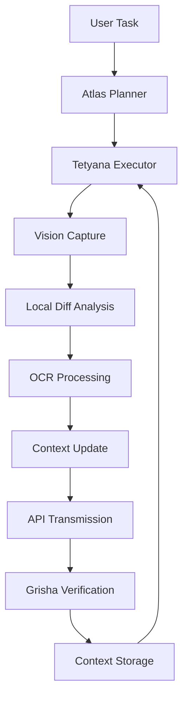

# Vision System Architecture for Project Atlas

## Overview

The Atlas Vision System implements **differential visual analysis** with **cyclical summarization** for efficient image processing in autonomous agent workflows.

## Core Principles

1. **Differential Analysis**: Compare frames to identify changes before full processing
2. **Local Preprocessing**: Perform OCR and structural analysis locally
3. **Context Preservation**: Maintain visual context across multiple frames
4. **API Optimization**: Send only diff data to reduce bandwidth
5. **Cyclical Summarization**: Update context with each new frame analysis

## Architecture Diagram



## Implementation Components

### 1. Differential Vision Analyzer

**Location**: `system_ai/tools/vision.py`

```python
class DifferentialVisionAnalyzer:
    """Core class for differential visual analysis"""

    def __init__(self):
        self.previous_frame = None
        self.context_history = []
        self.ocr_engine = PaddleOCR(use_angle_cls=True, lang='en+uk')
        self.similarity_threshold = 0.95  # For change detection

    def analyze_frame(self, image_path: str) -> dict:
        """
        Analyze frame with differential comparison

        Args:
            image_path: Path to current frame image

        Returns:
            dict: Analysis results with diff data
        """
        try:
            # 1. Load current frame
            current_frame = cv2.imread(image_path)
            if current_frame is None:
                return {"status": "error", "error": "Cannot load image"}

            # 2. Generate hash for comparison
            current_hash = self._generate_image_hash(current_frame)

            # 3. Compare with previous frame if available
            diff_result = {}
            if self.previous_frame is not None:
                diff_result = self._calculate_frame_diff(self.previous_frame, current_frame)

            # 4. Perform OCR analysis
            ocr_results = self._perform_ocr_analysis(image_path)

            # 5. Store current frame for next comparison
            self.previous_frame = current_frame
            self.context_history.append({
                "hash": current_hash,
                "timestamp": datetime.now().isoformat(),
                "diff": diff_result,
                "ocr": ocr_results
            })

            # 6. Limit history size
            if len(self.context_history) > 10:
                self.context_history.pop(0)

            return {
                "status": "success",
                "timestamp": datetime.now().isoformat(),
                "diff": diff_result,
                "ocr": ocr_results,
                "context": self._generate_context_summary(diff_result, ocr_results)
            }

        except Exception as e:
            return {
                "status": "error",
                "error": str(e),
                "timestamp": datetime.now().isoformat()
            }

    def _generate_image_hash(self, image) -> str:
        """Generate unique hash for image comparison"""
        return hashlib.md5(image.tobytes()).hexdigest()

    def _calculate_frame_diff(self, prev_frame, curr_frame) -> dict:
        """Calculate visual differences between frames"""
        # Structural difference
        structural_diff = cv2.absdiff(prev_frame, curr_frame)
        non_zero = cv2.countNonZero(structural_diff)
        total_pixels = prev_frame.size
        change_percentage = (non_zero / total_pixels) * 100

        # Color difference
        prev_hsv = cv2.cvtColor(prev_frame, cv2.COLOR_BGR2HSV)
        curr_hsv = cv2.cvtColor(curr_frame, cv2.COLOR_BGR2HSV)
        color_diff = cv2.absdiff(prev_hsv, curr_hsv)

        # Find changed regions
        _, thresh = cv2.threshold(structural_diff, 30, 255, cv2.THRESH_BINARY)
        contours, _ = cv2.findContours(thresh, cv2.RETR_EXTERNAL, cv2.CHAIN_APPROX_SIMPLE)

        changed_regions = []
        for cnt in contours:
            if cv2.contourArea(cnt) > 100:  # Filter small areas
                x, y, w, h = cv2.boundingRect(cnt)
                changed_regions.append({
                    "area": cv2.contourArea(cnt),
                    "bbox": {"x": x, "y": y, "width": w, "height": h},
                    "color_change": float(np.mean(color_diff[y:y+h, x:x+w]))
                })

        return {
            "global_change_percentage": change_percentage,
            "color_diff_intensity": float(np.mean(color_diff)),
            "changed_regions": changed_regions,
            "has_significant_changes": change_percentage > self.similarity_threshold
        }

    def _perform_ocr_analysis(self, image_path: str) -> dict:
        """Perform OCR on image with region analysis"""
        try:
            result = self.ocr_engine.ocr(image_path, cls=True)
            text_regions = []
            
            for line in result:
                for word in line:
                    text_regions.append({
                        "text": word[1][0],
                        "confidence": word[1][1],
                        "bbox": word[0]
                    })

            return {
                "status": "success",
                "regions": text_regions,
                "full_text": " ".join([r["text"] for r in text_regions])
            }
        except Exception as e:
            return {"status": "error", "error": str(e)}

    def _generate_context_summary(self, diff_data: dict, ocr_data: dict) -> str:
        """Generate human-readable context summary"""
        summary = []
        
        if diff_data.get("has_significant_changes", False):
            summary.append(f"Significant visual changes detected ({diff_data['global_change_percentage']:.1f}%)")
            summary.append(f"{len(diff_data.get('changed_regions', []))} regions changed")
        else:
            summary.append("Minimal visual changes detected")

        if ocr_data.get("status") == "success" and ocr_data.get("regions"):
            summary.append(f"OCR detected {len(ocr_data['regions'])} text regions")
            summary.append(f"Text: {ocr_data['full_text'][:100]}...")

        return ". ".join(summary) + "."
```

### 2. Vision Context Manager

**Location**: `core/vision_context.py` (new file)

```python
class VisionContextManager:
    """Manages visual context across multiple operations"""

    def __init__(self, max_history: int = 10):
        self.history = []
        self.max_history = max_history
        self.current_context = "No visual context available"

    def update_context(self, new_data: dict) -> None:
        """Update context with new visual data"""
        self.history.append({
            "timestamp": datetime.now().isoformat(),
            "data": new_data
        })
        
        # Limit history size
        if len(self.history) > self.max_history:
            self.history.pop(0)
        
        # Generate new summary
        self.current_context = self._generate_summary()

    def _generate_summary(self) -> str:
        """Generate context summary from history"""
        if not self.history:
            return "No visual context available"

        # Get most recent data
        recent = self.history[-1]["data"]
        
        summary_parts = [
            f"Last analysis: {self.history[-1]['timestamp']}",
            f"Changes: {recent.get('diff', {}).get('global_change_percentage', 0):.1f}%"
        ]

        if recent.get("ocr", {}).get("status") == "success":
            summary_parts.append(f"Text: {recent['ocr']['full_text'][:50]}...")

        return ". ".join(summary_parts) + "."

    def get_context_for_api(self) -> dict:
        """Get context data formatted for API transmission"""
        return {
            "history": self.history[-5:],  # Last 5 entries
            "current_summary": self.current_context,
            "analysis_count": len(self.history)
        }
```

### 3. Enhanced Vision Tools

**Location**: `system_ai/tools/vision.py` (extended)

```python
class EnhancedVisionTools:
    """Extended vision tools with differential capabilities"""

    @staticmethod
    def capture_and_analyze(image_path: str, reference_path: str = None) -> dict:
        """
        Capture image and perform differential analysis

        Args:
            image_path: Current image path
            reference_path: Optional reference image path

        Returns:
            dict: Analysis results
        """
        try:
            analyzer = DifferentialVisionAnalyzer()
            
            # If reference provided, set it as previous frame
            if reference_path:
                ref_frame = cv2.imread(reference_path)
                if ref_frame is not None:
                    analyzer.previous_frame = ref_frame
            
            return analyzer.analyze_frame(image_path)
            
        except Exception as e:
            return {
                "status": "error",
                "error": str(e),
                "timestamp": datetime.now().isoformat()
            }

    @staticmethod
    def analyze_with_context(image_path: str, context_manager: VisionContextManager) -> dict:
        """
        Analyze image with existing context

        Args:
            image_path: Image to analyze
            context_manager: Vision context manager

        Returns:
            dict: Enhanced analysis with context
        """
        # Perform basic analysis
        result = EnhancedVisionTools.capture_and_analyze(image_path)
        
        # Update context
        context_manager.update_context(result)
        
        # Add context to result
        result["context"] = {
            "current": context_manager.current_context,
            "history": context_manager.get_context_for_api()
        }
        
        return result
```

### 4. Trinity Integration

**Location**: `core/trinity.py` (extension)

```python
class TrinityRuntime:
    def __init__(self, *args, **kwargs):
        super().__init__(*args, **kwargs)
        
        # Initialize vision context manager
        self.vision_context = VisionContextManager(max_history=10)
        
        # Register enhanced vision tools
        from system_ai.tools.vision import EnhancedVisionTools
        self.registry.register_tool(
            "enhanced_vision_analysis",
            EnhancedVisionTools.capture_and_analyze,
            description="Capture image and perform differential visual analysis"
        )
        
        self.registry.register_tool(
            "vision_analysis_with_context",
            lambda args: EnhancedVisionTools.analyze_with_context(
                args.get("image_path"),
                self.vision_context
            ),
            description="Analyze image with visual context"
        )

    def _execute_vision_pipeline(self, task: str) -> dict:
        """Specialized pipeline for vision tasks"""
        # Use standard execution but with vision context
        result = self.workflow.invoke({
            "messages": [HumanMessage(content=task)],
            "current_agent": "atlas",
            "vision_context": self.vision_context.get_context_for_api()
        })
        
        return result
```

## Integration with Existing Components

### 1. Atlas Agent Enhancement

**File**: `core/agents/atlas.py`

```python
def get_atlas_vision_prompt(task_description: str, tools_desc: str) -> ChatPromptTemplate:
    """Enhanced prompt with vision capabilities"""
    return ChatPromptTemplate.from_messages([
        SystemMessage(content=f"""You are Atlas with enhanced vision capabilities.

VISION STRATEGY:
1. Use 'enhanced_vision_analysis' for all visual tasks
2. Compare with previous context when available
3. Request specific visual analysis based on task needs
4. Use diff data for efficient processing

AVAILABLE TOOLS:
{tools_desc}

CONTEXT: {{vision_context}}"""),
        HumanMessage(content=task_description)
    ])
```

### 2. Tetyana Executor Enhancement

**File**: `core/agents/tetyana.py`

```python
def get_tetyana_vision_prompt(task_description: str, tools_desc: str) -> ChatPromptTemplate:
    """Tetyana prompt with differential vision support"""
    return ChatPromptTemplate.from_messages([
        SystemMessage(content=f"""You are Tetyana with differential vision capabilities.

EXECUTION STRATEGY:
1. Capture baseline frame for comparison
2. Perform operations with visual feedback
3. Use enhanced_vision_analysis for verification
4. Compare results with baseline using diff analysis
5. Update vision context with new data

AVAILABLE TOOLS:
{tools_desc}

CONTEXT: {{vision_context}}"""),
        HumanMessage(content=task_description)
    ])
```

### 3. Grisha Verification Enhancement

**File**: `core/agents/grisha.py`

```python
def get_grisha_vision_prompt(task_description: str, tools_desc: str) -> ChatPromptTemplate:
    """Grisha prompt with context-aware verification"""
    return ChatPromptTemplate.from_messages([
        SystemMessage(content=f"""You are Grisha with context-aware vision verification.

VERIFICATION STRATEGY:
1. Analyze visual diff results
2. Compare with previous context
3. Verify changes match task requirements
4. Update context with verification results
5. Use cyclical summarization for continuous improvement

AVAILABLE TOOLS:
{tools_desc}

CONTEXT: {{vision_context}}"""),
        HumanMessage(content=task_description)
    ])
```

## Configuration

### 1. Environment Variables

Add to `.env.example`:
```ini
# Vision System Configuration
VISION_ENABLE_DIFF_ANALYSIS=true
VISION_MAX_CONTEXT_HISTORY=10
VISION_SIMILARITY_THRESHOLD=0.95
VISION_OCR_LANGUAGES=en,uk
VISION_ENABLE_GPU=false
```

### 2. Settings Integration

**File**: `tui/cli.py`

```python
def load_vision_settings():
    """Load vision system settings"""
    return {
        "diff_analysis": os.getenv("VISION_ENABLE_DIFF_ANALYSIS", "true").lower() == "true",
        "max_history": int(os.getenv("VISION_MAX_CONTEXT_HISTORY", "10")),
        "similarity_threshold": float(os.getenv("VISION_SIMILARITY_THRESHOLD", "0.95")),
        "ocr_languages": os.getenv("VISION_OCR_LANGUAGES", "en,uk").split(","),
        "enable_gpu": os.getenv("VISION_ENABLE_GPU", "false").lower() == "true"
    }

# Initialize vision settings
vision_settings = load_vision_settings()
```

## Usage Examples

### 1. Basic Differential Analysis

```python
from system_ai.tools.vision import EnhancedVisionTools

# Capture and analyze with differential comparison
result = EnhancedVisionTools.capture_and_analyze(
    image_path="current_screen.png",
    reference_path="previous_screen.png"
)

print(f"Changes detected: {result['diff']['global_change_percentage']:.1f}%")
print(f"Changed regions: {len(result['diff']['changed_regions'])}")
print(f"OCR results: {result['ocr']['status']}")
```

### 2. Context-Aware Operation

```python
from core.trinity import TrinityRuntime

# Initialize Trinity with vision context
trinity = TrinityRuntime()

# Execute visual task with context
result = trinity.execute_task(
    "Verify that the login button appeared after form submission"
)

# Access vision context
print(f"Current vision context: {trinity.vision_context.current_context}")
```

### 3. Cyclical Summarization

```python
from system_ai.tools.vision import EnhancedVisionTools
from core.vision_context import VisionContextManager

# Initialize context manager
context_manager = VisionContextManager(max_history=5)

# Process multiple frames
for i in range(3):
    # Capture and analyze
    result = EnhancedVisionTools.capture_and_analyze(f"frame_{i}.png")
    
    # Update context
    context_manager.update_context(result)
    
    # Get summary
    print(f"Frame {i} summary: {context_manager.current_context}")

# Get full context for API
api_context = context_manager.get_context_for_api()
print(f"Context for API: {len(api_context['history'])} entries")
```

## Performance Considerations

### 1. Memory Management

- **History Limitation**: Set `VISION_MAX_CONTEXT_HISTORY` based on available memory
- **Image Compression**: Use JPEG compression for stored frames
- **Garbage Collection**: Implement cleanup for old analysis data

```python
# Example memory optimization
class OptimizedVisionContext(VisionContextManager):
    def __init__(self):
        super().__init__()
        self.image_cache = LRUCache(maxsize=5)  # Limit cached images

    def update_context(self, new_data):
        # Compress images before storing
        if 'image' in new_data:
            new_data['image'] = compress_image(new_data['image'])
        super().update_context(new_data)
```

### 2. Processing Optimization

- **Multithreading**: Parallel OCR and diff analysis
- **Caching**: Cache analysis results for similar images
- **GPU Acceleration**: Use CUDA for image processing

```python
# Example parallel processing
def analyze_in_parallel(image_path):
    with ThreadPoolExecutor() as executor:
        diff_future = executor.submit(analyze_diff, image_path)
        ocr_future = executor.submit(perform_ocr, image_path)
        
        return {
            'diff': diff_future.result(),
            'ocr': ocr_future.result()
        }
```

### 3. Network Efficiency

- **Diff Compression**: Compress diff data before transmission
- **Batch Processing**: Combine multiple diffs in one request
- **Retry Logic**: Implement robust error handling

```python
# Example API transmission
def send_to_api(diff_data):
    try:
        compressed = compress_diff(diff_data)
        response = requests.post(
            API_ENDPOINT,
            json=compressed,
            headers={'Content-Encoding': 'gzip'},
            timeout=10
        )
        return response.json()
    except RequestException as e:
        log_error(e)
        return retry_transmission(diff_data)
```

## Testing

### 1. Unit Tests

```python
# tests/test_vision.py
import pytest
from system_ai.tools.vision import DifferentialVisionAnalyzer

def test_differential_analysis():
    analyzer = DifferentialVisionAnalyzer()
    
    # Test with identical images
    result = analyzer.analyze_frame("test_image.png")
    assert result["status"] == "success"
    assert "diff" in result
    assert "ocr" in result

def test_change_detection():
    analyzer = DifferentialVisionAnalyzer()
    
    # Set reference frame
    analyzer.previous_frame = cv2.imread("reference.png")
    
    # Test with different image
    result = analyzer.analyze_frame("different.png")
    assert result["diff"]["has_significant_changes"] == True
    assert result["diff"]["global_change_percentage"] > 5.0
```

### 2. Integration Tests

```python
def test_trinity_vision_integration():
    from core.trinity import TrinityRuntime
    
    trinity = TrinityRuntime()
    result = trinity.execute_task("Analyze visual changes on screen")
    
    assert "vision_analysis" in result
    assert "context_update" in result
    assert trinity.vision_context.current_context != "No visual context available"
```

### 3. Performance Tests

```python
def test_vision_performance():
    import time
    from system_ai.tools.vision import DifferentialVisionAnalyzer
    
    analyzer = DifferentialVisionAnalyzer()
    
    # Test processing speed
    start_time = time.time()
    for i in range(10):
        analyzer.analyze_frame(f"test_frame_{i}.png")
    
    duration = time.time() - start_time
    assert duration < 2.0  # Should process 10 frames in <2 seconds
```

## Future Enhancements

1. **3D Spatial Analysis**: Add depth perception using stereo cameras
2. **Real-time Processing**: Implement streaming diff analysis for video
3. **Multi-modal Integration**: Combine vision with audio and text analysis
4. **Adaptive Thresholds**: Auto-adjust similarity thresholds based on task type
5. **Cross-frame Correlation**: Track objects across multiple frames using SIAMese networks
6. **Semantic Understanding**: Add scene comprehension using vision-language models
7. **Predictive Analysis**: Forecast future states based on current changes

## Migration Guide

### From Current System

1. **Backup existing vision tools**:
   ```bash
   cp system_ai/tools/vision.py system_ai/tools/vision_backup.py
   ```

2. **Install dependencies**:
   ```bash
   pip install paddleocr opencv-python numpy scikit-image
   ```

3. **Update MCP registry**:
   ```python
   # In core/mcp.py
   from system_ai.tools.vision import EnhancedVisionTools
   registry.register_tool("enhanced_vision_analysis", EnhancedVisionTools.capture_and_analyze)
   ```

4. **Create context manager**:
   ```bash
   touch core/vision_context.py
   ```

5. **Test integration**:
   ```bash
   python -m pytest tests/test_vision.py -v
   ```

6. **Deploy gradually**:
   - Start with non-critical visual tasks
   - Monitor memory usage and performance
   - Expand to all visual operations

## Troubleshooting

### Common Issues and Solutions

| Issue | Symptom | Solution |
|-------|---------|----------|
| High memory usage | System slows down | Reduce `VISION_MAX_CONTEXT_HISTORY` to 5-7 |
| Slow OCR processing | Delays in text recognition | Enable GPU acceleration or reduce resolution |
| False positive changes | Too many changes detected | Increase `VISION_SIMILARITY_THRESHOLD` to 0.97 |
| API connection errors | Failed transmissions | Implement retry logic with exponential backoff |
| Image load failures | Cannot process images | Verify image paths and permissions |

### Debugging Commands

```bash
# Check vision context
python -c "from core.trinity import TrinityRuntime; t = TrinityRuntime(); print(t.vision_context.current_context)"

# Test differential analysis
python -c "from system_ai.tools.vision import EnhancedVisionTools; print(EnhancedVisionTools.capture_and_analyze('test.png'))"

# Monitor memory usage
python -c "import psutil; print(psutil.Process().memory_info().rss / 1024 / 1024, 'MB')"
```

## References

1. [PaddleOCR Documentation](https://github.com/PaddlePaddle/PaddleOCR)
2. [OpenCV Computer Vision](https://docs.opencv.org/master/)
3. [Vision Transformers (ViT) Paper](https://arxiv.org/abs/2010.11929)
4. [Context-Aware Vision Systems](https://arxiv.org/abs/2103.11911)
5. [Differential Image Analysis Techniques](https://ieeexplore.ieee.org/document/9157644)

---

**Status**: Proposed for implementation
**Priority**: High
**Complexity**: Medium
**Estimated Time**: 2-3 weeks for full integration
