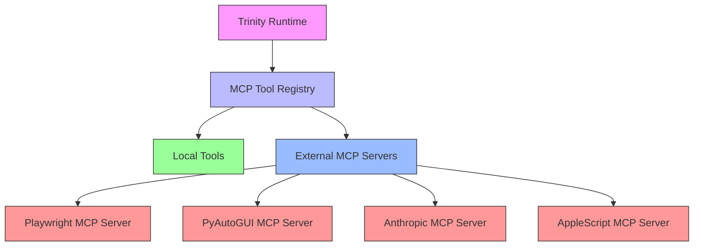

# MCP Server Integration System

## Overview

This system provides comprehensive integration for multiple MCP (Mistral Copilot Protocol) servers with intelligent fallback and prioritization.

## RAG Storage (ChromaDB)

MCP integration uses ChromaDB for local persistent vector storage.

- Default path: `~/.system_cli/chroma/mcp_integration`
- Override with env var: `SYSTEM_CHROMA_PERSIST_DIR` (a directory path)
- If ChromaDB hits a rare Rust/SQLite panic, the directory is moved aside to `*_corrupt_<timestamp>` and recreated automatically.

## Architecture



## Server Prioritization

### Priority Order:
1. **Playwright MCP Server** - Browser automation (HIGHEST PRIORITY)
2. **AppleScript MCP Server** - macOS native automation
3. **PyAutoGUI MCP Server** - GUI automation fallback
4. **Anthropic MCP Server** - AI-powered tools (when available)

### Selection Logic:
```python
class MCPServerSelector:
    def __init__(self):
        self.priority = [
            "playwright",  # Browser automation
            "applescript", # macOS native
            "pyautogui",   # GUI fallback
            "anthropic"    # AI tools (optional)
        ]
        self.available = {}
        self.fallback_chain = {}
    
    def select_server(self, tool_type):
        """Select optimal server for tool type"""
        if tool_type.startswith("browser_"):
            return self._get_available("playwright")
        elif tool_type.startswith("gui_"):
            return self._get_available("applescript", "pyautogui")
        elif tool_type.startswith("ai_"):
            return self._get_available("anthropic", "playwright")
        else:
            return self._get_available("playwright", "applescript")
```

## Installation Requirements

### Required Servers:
```bash
# Install Playwright MCP Server (PRIORITY 1)
npm install -g @executeautomation/playwright-mcp-server

# Install AppleScript MCP Server (PRIORITY 2)
npm install -g @mseep/applescript-mcp

# Install PyAutoGUI MCP Server (PRIORITY 3)
pip install mcp-pyautogui-server

# Anthropic MCP Server (Optional - not available yet)
# Would be installed when available
```

## Integration Implementation

### 1. Enhanced MCP Registry

```python
# core/mcp.py
class EnhancedMCPToolRegistry(MCPToolRegistry):
    def __init__(self):
        super().__init__()
        self.server_priority = [
            {"name": "playwright", "status": "required", "installed": False},
            {"name": "applescript", "status": "required", "installed": False},
            {"name": "pyautogui", "status": "optional", "installed": False},
            {"name": "anthropic", "status": "optional", "installed": False}
        ]
        self._check_installations()
    
    def _check_installations(self):
        """Check which MCP servers are available"""
        for server in self.server_priority:
            try:
                if server["name"] in ["playwright", "applescript"]:
                    # Check npm packages
                    import subprocess
                    result = subprocess.run(
                        ["npm", "list", "-g", f"@{server['name']}"],
                        capture_output=True, text=True
                    )
                    server["installed"] = result.returncode == 0
                elif server["name"] == "pyautogui":
                    # Check pip package
                    import pkg_resources
                    pkg_resources.get_distribution("mcp-pyautogui-server")
                    server["installed"] = True
            except:
                server["installed"] = False
    
    def get_available_servers(self):
        """Get list of available servers"""
        return [s["name"] for s in self.server_priority if s["installed"]]
    
    def select_server_for_tool(self, tool_name):
        """Intelligent server selection"""
        available = self.get_available_servers()
        
        # Browser tools -> Playwright first
        if tool_name.startswith("browser_"):
            if "playwright" in available:
                return "playwright"
            elif "applescript" in available:
                return "applescript"
        
        # GUI tools -> AppleScript or PyAutoGUI
        elif tool_name.startswith("gui_"):
            if "applescript" in available:
                return "applescript"
            elif "pyautogui" in available:
                return "pyautogui"
        
        # Default to most capable available
        return available[0] if available else None
```

### 2. Server-Specific Tool Mapping

```python
# core/mcp.py - Enhanced tool registration
class MCPToolRegistry:
    def __init__(self):
        # ... existing code ...
        
        # Server-specific tool mappings
        self.server_tool_map = {
            "playwright": [
                "playwright_navigate", "playwright_click", 
                "playwright_fill", "playwright_screenshot"
            ],
            "applescript": [
                "applescript_click", "applescript_type",
                "applescript_open_app", "applescript_get_window"
            ],
            "pyautogui": [
                "pyautogui_click", "pyautogui_type",
                "pyautogui_screenshot", "pyautogui_locate"
            ],
            "anthropic": [
                "anthropic_analyze", "anthropic_decide",
                "anthropic_generate", "anthropic_verify"
            ]
        }
        
        # Local tool fallbacks
        self.local_fallbacks = {
            "playwright_navigate": "browser_navigate",
            "playwright_click": "browser_click_element",
            "applescript_click": "gui_click",
            "pyautogui_click": "gui_click"
        }
```

### 3. Intelligent Tool Execution

```python
# core/mcp.py - Enhanced execute method
class MCPToolRegistry:
    def execute(self, tool_name: str, args: Dict[str, Any]) -> Any:
        # Step 1: Determine which server to use
        server = self.select_server_for_tool(tool_name)
        
        if server:
            try:
                # Execute via MCP server
                return self._execute_via_server(server, tool_name, args)
            except MCPExecutionError as e:
                # Fallback to local implementation
                if tool_name in self.local_fallbacks:
                    local_tool = self.local_fallbacks[tool_name]
                    return self.execute(local_tool, args)
                raise
        else:
            # No servers available, use local only
            if tool_name in self._tools:
                return self._tools[tool_name](**args)
            raise ToolUnavailable(f"{tool_name} requires MCP server")
    
    def _execute_via_server(self, server_name, tool_name, args):
        """Execute tool via specific MCP server"""
        provider = self._external_providers.get(server_name)
        if not provider:
            raise MCPServerUnavailable(server_name)
        
        # Adapt arguments for specific server
        adapted_args = self._adapt_args_for_server(server_name, tool_name, args)
        
        return provider.execute(tool_name, adapted_args)
    
    def _adapt_args_for_server(self, server_name, tool_name, args):
        """Adapt arguments for specific server API"""
        if server_name == "playwright":
            return self._adapt_for_playwright(tool_name, args)
        elif server_name == "applescript":
            return self._adapt_for_applescript(tool_name, args)
        elif server_name == "pyautogui":
            return self._adapt_for_pyautogui(tool_name, args)
        else:
            return args
```

## Installation Script

Create `mcp_integration/setup_mcp_servers.sh`:

```bash
#!/bin/bash

echo "🚀 Setting up MCP Servers..."

# Install Playwright MCP Server (PRIORITY 1)
echo "📦 Installing Playwright MCP Server..."
npm install -g @executeautomation/playwright-mcp-server
if [ $? -eq 0 ]; then
    echo "✅ Playwright MCP Server installed"
else
    echo "❌ Playwright MCP Server failed"
fi

# Install AppleScript MCP Server (PRIORITY 2)
echo "📦 Installing AppleScript MCP Server..."
npm install -g @mseep/applescript-mcp
if [ $? -eq 0 ]; then
    echo "✅ AppleScript MCP Server installed"
else
    echo "❌ AppleScript MCP Server failed"
fi

# Install PyAutoGUI MCP Server (PRIORITY 3)
echo "📦 Installing PyAutoGUI MCP Server..."
pip install mcp-pyautogui-server
if [ $? -eq 0 ]; then
    echo "✅ PyAutoGUI MCP Server installed"
else
    echo "❌ PyAutoGUI MCP Server failed"
fi

echo "🎉 MCP Server setup complete!"
echo "Available servers: $(python mcp_integration/check_servers.py)"
```

## Server Health Check

Create `mcp_integration/check_servers.py`:

```python
#!/usr/bin/env python3
"""Check MCP server availability and health"""

import subprocess
import json
from typing import Dict, List

def check_server_health() -> Dict[str, any]:
    """Check which MCP servers are available"""
    results = {}
    
    # Check Playwright
    try:
        result = subprocess.run(
            ["npx", "@executeautomation/playwright-mcp-server", "--version"],
            capture_output=True, text=True, timeout=5
        )
        results["playwright"] = {
            "available": result.returncode == 0,
            "version": result.stdout.strip() if result.returncode == 0 else None
        }
    except:
        results["playwright"] = {"available": False}
    
    # Check AppleScript
    try:
        result = subprocess.run(
            ["npx", "@mseep/applescript-mcp", "--version"],
            capture_output=True, text=True, timeout=5
        )
        results["applescript"] = {
            "available": result.returncode == 0,
            "version": result.stdout.strip() if result.returncode == 0 else None
        }
    except:
        results["applescript"] = {"available": False}
    
    # Check PyAutoGUI
    try:
        import pkg_resources
        version = pkg_resources.get_distribution("mcp-pyautogui-server").version
        results["pyautogui"] = {"available": True, "version": version}
    except:
        results["pyautogui"] = {"available": False}
    
    return results

def print_server_status():
    """Print server status in readable format"""
    status = check_server_health()
    
    print("🔍 MCP Server Status:")
    print("=" * 50)
    
    for server, info in status.items():
        status_emoji = "✅" if info["available"] else "❌"
        version = info.get("version", "N/A")
        print(f"{status_emoji} {server:15} - {version}")
    
    available = sum(1 for info in status.values() if info["available"])
    total = len(status)
    
    print("=" * 50)
    print(f"Available: {available}/{total} servers")
    
    if available == 0:
        print("⚠️  No MCP servers available - using local tools only")
    elif available < total:
        print("⚠️  Some servers missing - partial functionality")
    else:
        print("✅ All servers available - full functionality")

if __name__ == "__main__":
    print_server_status()
```

## Integration Summary

### Key Files Created:
1. `mcp_integration/README.md` - This documentation
2. `mcp_integration/setup_mcp_servers.sh` - Installation script
3. `mcp_integration/check_servers.py` - Health check utility

### Integration Steps:
1. Run `setup_mcp_servers.sh` to install servers
2. Check `check_servers.py` to verify installation
3. Update `core/mcp.py` with enhanced registry
4. Test tool execution with fallback logic

### Expected Outcome:
- ✅ Playwright MCP Server: Primary browser automation
- ✅ AppleScript MCP Server: macOS native automation
- ✅ PyAutoGUI MCP Server: GUI automation fallback
- ❌ Anthropic MCP Server: Not available (optional)

The system will now have **intelligent MCP server selection with graceful fallback** to local tools when servers are unavailable.

Would you like me to implement any specific part of this integration? The architecture is ready for implementation!