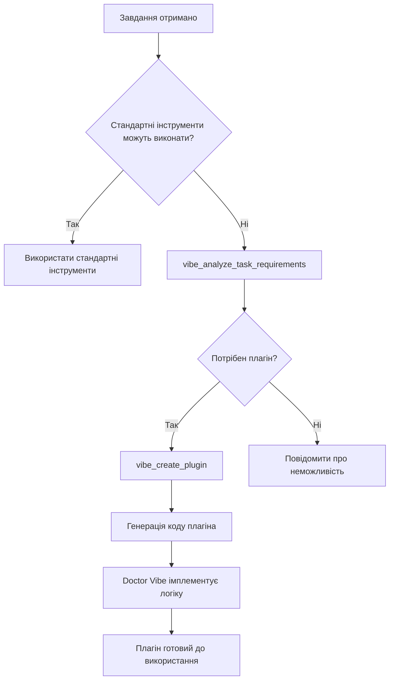

# Doctor Vibe Extensions - Автоматична генерація плагінів

## 🎯 Призначення

Цей плагін дозволяє Doctor Vibe **автоматично створювати спеціалізовані плагіни** коли стандартні інструменти Trinity не можуть виконати завдання.

## 🚀 Як це працює



## 📦 Інструменти

### 1. `vibe_analyze_task_requirements`

Аналізує чи потрібен спеціалізований плагін для виконання завдання.

**Аргументи:**
- `task_description` (str): Опис завдання
- `failed_attempts` (list, optional): Список попередніх невдалих спроб

**Повертає:**
```python
{
    "requires_plugin": bool,          # Чи потрібен плагін
    "plugin_type": str,               # Тип плагіна (api, database, custom, etc.)
    "detected_types": List[str],      # Виявлені типи можливостей
    "missing_capabilities": List[str],# Відсутні можливості
    "suggested_tools": List[Dict],    # Запропоновані інструменти
    "confidence": float,              # Впевненість в аналізі (0-1)
    "standard_tools_failed": bool     # Чи провалились стандартні інструменти
}
```

**Приклад:**
```python
result = vibe_analyze_task_requirements(
    task_description="Parse PDF invoices and extract data to PostgreSQL",
    failed_attempts=["read_file", "grep_search"]
)
# Result: requires_plugin=True, plugin_type="file_format", detected_types=["file_format", "database"]
```

### 2. `vibe_create_plugin`

Автоматично генерує спеціалізований плагін для Doctor Vibe.

**Аргументи:**
- `task_description` (str): Що потрібно виконати
- `plugin_name` (str, optional): Назва плагіна (авто-генерується якщо не вказано)
- `plugin_type` (str, optional): Тип плагіна (default: "custom")
- `auto_implement` (bool, optional): Чи намагатися автоматично імплементувати (default: False)

**Повертає:**
```python
{
    "status": "success"|"error"|"not_needed",
    "plugin_name": str,
    "plugin_path": str,
    "plugin_type": str,
    "tools_generated": List[str],
    "message": str,
    "next_steps": List[str]
}
```

**Приклад:**
```python
result = vibe_create_plugin(
    task_description="Create REST API client for Stripe payments",
    plugin_name="stripe_integration"
)
# Створює plugins/stripe_integration/ з інструментами для API запитів
```

## 🎭 Типи плагінів

Система розпізнає і генерує плагіни для:

| Тип | Ключові слова | Приклади інструментів |
|-----|---------------|----------------------|
| **api** | api, rest, graphql, endpoint | `make_api_request`, `parse_api_response` |
| **database** | database, sql, query, mongodb | `execute_query`, `fetch_records` |
| **file_format** | pdf, excel, csv, parse | `parse_file`, `convert_format` |
| **cloud** | aws, azure, s3, cloud | `upload_to_cloud`, `download_from_cloud` |
| **automation** | automate, workflow, pipeline | `create_workflow`, `schedule_task` |
| **integration** | integrate, sync, webhook | `sync_data`, `handle_webhook` |
| **data_processing** | transform, filter, aggregate | `transform_data`, `aggregate_results` |

## 📝 Workflow Doctor Vibe

### Сценарій 1: Автоматичне виявлення потреби

```python
# 1. Користувач: "Parse all PDF files in ./invoices and save to database"

# 2. Trinity спробує стандартні інструменти (read_file, etc.) - провал

# 3. Doctor Vibe викликає аналіз:
analysis = vibe_analyze_task_requirements(
    task_description="Parse all PDF files in ./invoices and save to database",
    failed_attempts=["read_file", "file_search"]
)

# 4. Якщо requires_plugin=True, створює плагін:
if analysis["requires_plugin"]:
    plugin = vibe_create_plugin(
        task_description="Parse all PDF files in ./invoices and save to database",
        plugin_type=analysis["plugin_type"]  # "file_format"
    )
    
# 5. Doctor Vibe отримує структуру плагіна і імплементує логіку
# 6. Плагін автоматично завантажується в Trinity
# 7. Завдання виконується за допомогою нового плагіна
```

### Сценарій 2: Явний запит на створення плагіна

```python
# Користувач: "Створи плагін для роботи з Telegram Bot API"

plugin = vibe_create_plugin(
    task_description="Telegram Bot API integration with send_message and receive_updates",
    plugin_name="telegram_bot_api",
    plugin_type="api"
)

# Doctor Vibe отримує:
# - plugins/telegram_bot_api/plugin.py з заглушками
# - Список інструментів: make_api_request, parse_api_response
# - Інструкції для імплементації
```

## 🔄 Життєвий цикл авто-плагіна

1. **Виявлення потреби**: `vibe_analyze_task_requirements()` визначає чи потрібен плагін
2. **Генерація структури**: `vibe_create_plugin()` створює папку, файли, шаблони
3. **Імплементація**: Doctor Vibe пише реальну логіку в згенеровані функції
4. **Тестування**: Doctor Vibe створює тести для нових інструментів
5. **Реєстрація**: Плагін автоматично завантажується в Trinity при наступному запуску
6. **Використання**: Інструменти плагіна доступні через MCP registry

## 🧪 Тестування

```bash
# Запустити тести плагіна
pytest plugins/doctor_vibe_extensions/tests/ -v

# Тест аналізу вимог
pytest plugins/doctor_vibe_extensions/tests/test_plugin.py::test_analyze_task_requirements -v

# Тест створення плагіна
pytest plugins/doctor_vibe_extensions/tests/test_plugin.py::test_create_vibe_plugin -v
```

## 📚 Приклади використання

### Приклад 1: REST API клієнт

```python
# Завдання: інтеграція з GitHub API
result = vibe_create_plugin(
    task_description="GitHub API client to create issues and pull requests",
    plugin_name="github_api_client"
)

# Згенеровано:
# - plugins/github_api_client/plugin.py
# - Інструменти: make_api_request, parse_api_response
# - Doctor Vibe імплементує GitHub OAuth, REST calls
```

### Приклад 2: База даних

```python
# Завдання: спеціалізовані запити до MongoDB
result = vibe_create_plugin(
    task_description="MongoDB analytics queries with aggregation pipelines",
    plugin_name="mongo_analytics"
)

# Згенеровано:
# - plugins/mongo_analytics/plugin.py
# - Інструменти: execute_query, fetch_records
# - Doctor Vibe імплементує aggregation, connection pooling
```

### Приклад 3: Парсинг файлів

```python
# Завдання: обробка Excel звітів
result = vibe_create_plugin(
    task_description="Parse Excel financial reports and generate PDF summaries",
    plugin_name="excel_report_processor"
)

# Згенеровано:
# - plugins/excel_report_processor/plugin.py
# - Інструменти: parse_file, convert_format
# - Doctor Vibe імплементує openpyxl + reportlab логіку
```

## 🎓 Best Practices

1. **Чіткі описи**: Надавайте детальний `task_description` для кращого аналізу
2. **Інкрементальний розвиток**: Створюйте прості плагіни і розширюйте їх поступово
3. **Тестування**: Завжди пишіть тести для згенерованих інструментів
4. **Документація**: Оновлюйте README.md згенерованих плагінів
5. **Перевикористання**: Шукайте існуючі плагіни перед створенням нових

## 🔐 Безпека

- Згенеровані плагіни мають базову структуру без небезпечного коду
- Doctor Vibe повинен перевіряти згенерований код перед імплементацією
- Не зберігайте credentials в коді плагіна (використовуйте .env)
- Валідуйте всі вхідні дані в інструментах плагіна

## 🛠️ Налаштування

Плагін працює "з коробки", але можна налаштувати:

```python
# В plugin.py можна змінити шаблони інструментів
tool_templates = {
    "custom_type": [
        {"name": "custom_tool", "description": "My custom tool"}
    ]
}
```

## 📈 Статистика

- **Підтримуваних типів плагінів**: 7 (api, database, file_format, cloud, automation, integration, data_processing)
- **Базових шаблонів інструментів**: 14
- **Розпізнаваних ключових слів**: 30+

## 🤝 Contribution

Для додавання нових типів плагінів:

1. Додайте ключові слова в `plugin_indicators` (analyze_task_requirements)
2. Додайте шаблони інструментів в `tool_templates` (_suggest_tools)
3. Оновіть документацію
4. Додайте тести

---

**Created by**: Trinity System  
**Version**: 1.0.0  
**License**: Internal use only
