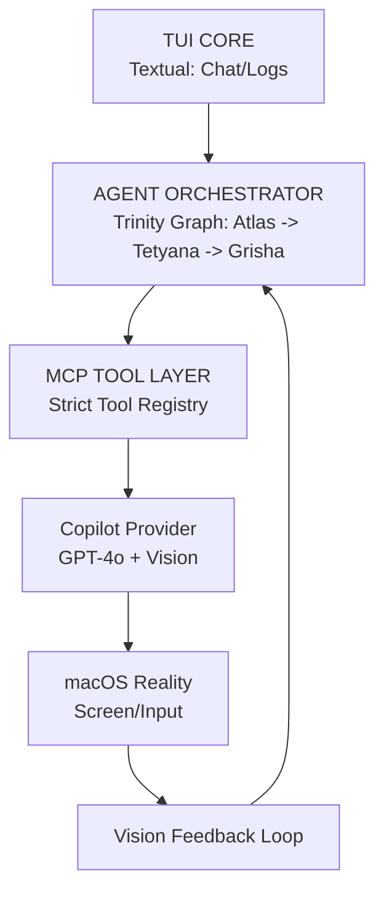

# Технічне Завдання: Project Atlas (NeuroMac Vision Agent)

**Клас системи:** Vision-Augmented Agentic OS Controller
**Платформа:** Mac Studio M1 Max
**LLM-провайдер:** GitHub Copilot (GPT-4o для reasoning/tools + gpt-4o-vision для screen understanding)
**Парадигма:** MCP-first + Agent Graph + Vision Feedback Loop
**Форма:** Єдиний локальний «нейронний мозок» macOS

⸻

## 1. Сутність та Мета
Це не чат-бот і не макроси. Це **локальний нейронний оператор macOS "Atlas"**, який:
- Бачить екран.
- Планує дії.
- Виконує їх виключно через дозволені MCP-інструменти.
- Перевіряє результат зором (Vision Feedback).
- Самовиправляється та накопичує досвід (RAG).

Vision — обов'язковий у кожному циклі. LLM керує ТІЛЬКИ через MCP-tools.

⸻

## 2. Ключові принципи
*   ❌ **No Local Scale:** Без Ollama/MLX. Тільки GitHub Copilot (GPT-4o).
*   ❌ **No Direct Access:** LLM не має прямого неконтрольованого доступу.
*   ✅ **MCP-First:** Строгий контракт дій (детермінізм + безпека).
*   ✅ **Vision Feedback:** Системний зворотний зв'язок (імітація «backpropagation» в UI).
*   ✅ **RAG Memory:** Поведінкова пам'ять агента.

⸻

## 3. Архітектура Системи

### 3.1 Agent Orchestrator ("Trinity" Implementation)
Реалізовано на базі **LangGraph**.
*   **Atlas (Planner):** Стратег. Приймає задачу, формує план, вставляє точки верифікації (Adaptive Verification).
*   **Tetyana (Executor + Dev Subsystem):** "Універсальний Оператор". Виконує MCP-інструменти (Shell, Files, Windsurf Driver).
*   **Grisha (Critic/Vision):** "Очі". Аналізує скріншоти, порівнює стан з очікуваним, дає дозвіл на наступний крок.

### 3.2 Vision Feedback Loop (Adaptive Verification)
Головна інновація.
1.  **PLAN:** Atlas створює план.
2.  **ACTION:** Tetyana виконує MCP tool.
3.  **CAPTURE:** Grisha робить знімок.
4.  **ANALYSIS:** GPT-4o-Vision аналізує стан.
5.  **COMPARISON:** Очікування vs Реальність.
6.  **DECISION:** OK -> Next Step | NO -> Replan (Dynamic Granularity).

### 3.3 Dev Subsystem (Cascading Control)
Для задач кодингу працює каскад:
**Copilot (Meta) -> Continue CLI (Bus) -> Windsurf (Exec)**.

⸻

## 4. MCP Tool Registry (Ядро)
Система взаємодіє зі світом ТІЛЬКИ через ці функції:

*   `capture_screen(region?)`
*   `analyze_screen(image_b64, goal)`
*   `find_element(description)`
*   `run_shell(command)` (з підтвердженням)
*   `open_app(name)`
*   `read_file/write_file`
*   `send_to_windsurf(message)`
*   `rag_query/save_memory`

⸻

## 5. RAG — Поведінкова Пам'ять
Локальна ChromaDB.
*   `ui_patterns`: Як виглядають кнопки/меню.
*   `action_strategies`: Успішні послідовності дій.
*   `user_habits`: Вподобання користувача.

⸻

## 6. Критерій Успіху
**Atlas** — це OS-level cognitive agent, який:
1.  Бачить інтерфейс як людина.
2.  Діє через інструменти як інженер.
3.  Розуміє помилки через Vision і виправляє їх сам.

⸻

## 7. Порядок Реалізації
1.  **MCP Tool Registry + Basic Actions** (Click/Type/Exec) — *FOUNDATION*.
2.  **Vision Capture + Analyze** (GPT-4o-Vision integration) — *HEART*.
3.  **Feedback Loop** (Retry logic & Adaptive Verifier) — *BRAIN*.
4.  **TUI Skeleton** — *INTERFACE*.
5.  **RAG Schema** — *MEMORY*.

⸻

1. Концепція Системи

Створення автономної інтелектуальної системи, де *група спеціалізованих агентів* спілкується між собою у вільному форматі (як команда інженерів), спільно вирішуючи складні завдання.

**Ключові принципи:**
1.  **Conversation-First:** Агенти ведуть діалог, сперечаються, перевіряють один одного та планують дії перед виконанням.
2.  **Role Separation:** Чіткий розподіл ролей (Архітектор, Виконавець, Ревізор/Безпека).
3.  **Dev Subsystem Encapsulation:** Робота з кодом винесена в окремий захищений контур, яким керує Виконавець (Тетяна).

⸻

2. Рольова Модель (The Trinity)

2.1 Atlas (Архітектор / Supervisor)
*   **Роль:** Керівник проекту, Стратег.
*   **Відповідальність:**
    *   Прийом вхідної задачі від користувача.
    *   Декомпозиція задачі на менші етапи.
    *   Розподіл завдань між іншими агентами.
    *   Прийняття фінального рішення у спірних ситуаціях.
*   **Поведінка:** Виважена, стратегічна. Може сказати: "Тетяна, цей підхід занадто ризикований, давай спробуємо інакше".

2.2 Tetyana (Виконавець / Universal Operator)
*   **Роль:** Головний Оператор Системи.
*   **Відповідальність:**
    *   **General Tasks:** Виконання будь-яких дій в ОС (відкрити браузер, знайти файл, налаштувати систему).
    *   **Dev Tasks:** Написання коду (через Dev Subsystem).
    *   Робота з терміналом.
*   **Поведінка:** Практична, орієнтована на результат. Якщо задача не про код — робить сама. Якщо про код — активує Windsurf.

2.3 Grisha (Візор / Security & QA)
*   **Роль:** Безпека, Контроль якості, "Очі" системи.
*   **Відповідальність:**
    *   Візуальний контроль (Vision) — підтвердження, що на екрані відбувається те, що очікується.
    *   Security Audit — блокування деструктивних команд (rm -rf /, upload keys і т.д.).
    *   Код-рев'ю — аналіз планів Тетяни перед виконанням.
*   **Поведінка:** Критична, підозріла. Має право "вето" на дії Тетяни.

⸻

3. Архітектура Взаємодії (Communication Layer)

3.1 Протокол "Вільний Діалог" (AutoGen-style)
Замість жорсткого ланцюжка (Chain), система використовує граф станів (State Graph), де агенти обмінюються повідомленнями у спільній історії (Thread).

**Типовий сценарій:**
1.  **Atlas:** "Маємо задачу X. Тетяна, запропонуй план реалізації."
2.  **Tetyana:** "Пропоную використати бібліотеку Y. Ось план дій..."
3.  **Grisha:** "Чекай. Бібліотека Y має вразливість CVE-xyz. Тетяна, знайди безпечний аналог."
4.  **Tetyana:** "Зрозуміла. Використаю бібліотеку Z. Atlas, затверджуєш?"
5.  **Atlas:** "Затверджую. Тетяна, приступай. Гріша, слідкуй за виконанням."

3.2 Оркестрація (Graph Core)
*   Для керування станом розмови використовується **State Graph** (наприклад, на базі LangGraph або custom state machine).
*   Граф визначає переходи: хто говорить наступним, коли діалог переходить у фазу виконання (Execution), а коли повертається на доопрацювання.

1.1 Універсальність
Система є універсальною. Вона обробляє будь-які запити користувача:
*   Робота з ОС (файли, додатки, налаштування).
*   Робота з медіа та браузером.
*   Пошук інформації.
*   **Розробка (як окремий важливий під-процес).**

1.2 Спеціалізація на коді (Dev Subsystem)
Лише якщо завдання стосується код/розробки, воно виконується через спеціалізований контур **Dev Subsystem**. Для всіх інших задач використовуються стандартні інструменти ОС.

⸻

4. Підсистема Розробки (Dev Subsystem) — "Cascading Control"
**Архітектурна Специфікація**

4.1 Мета та Принцип Каскаду
Реалізовано каскадну агентну архітектуру, де **Copilot (GPT-4o)** виступає мета-контролером, що керує **Windsurf IDE (GPT-5.2)** через шину **Continue CLI**.

**Компоненти Каскаду:**
1.  **Copilot LLM (Meta-Controller):**
    *   Роль: Контроль, аналіз, прийняття рішень (Stop-умови).
    *   Реалізація: `providers/copilot.py` (Atlas/Tetyana Personas).
    *   Принцип: Єдиний носій "волі" системи.
2.  **Continue CLI (Instrumental Bus):**
    *   Роль: Маршрутизатор та виконавець.
    *   Функція: Передає запити у Windsurf, повертає відповіді, не має власного reasoning.
3.  **Windsurf IDE (Execution Engine):**
    *   Роль: Глибокий аналіз коду та генерація рішень.
    *   Модель: GPT-5.2 Medium Reasoning.
    *   Статус: Працює у стандартному режимі, вважаючи, що спілкується з користувачем.

4.2 Оркестрація (LangGraph & TaskGraph)
Система керується двома графами:
*   **LangGraph (Conversation Flow):** Керує станом діалогу між персонами (Atlas -> Tetyana -> Grisha) та циклами перевірки.
*   **TaskGraph (Execution State):** Відстежує прогрес виконання задачі (Task ID, Status, Artifacts) через `task.md` та пам'ять агента.

4.3 Потік Взаємодії (Interaction Flow)
1.  **Copilot (Tetyana)** формує запит (людською мовою).
2.  **Continue CLI** передає запит у Windsurf (Tool: `send_to_windsurf`).
3.  **Windsurf** генерує код/відповідь.
4.  **Continue CLI** повертає результат Tetyana.
5.  **Copilot (Tetyana/Grisha)** аналізує:
    *   Достатність відповіді? -> *Stop* або *Continue*.
    *   Помилки? -> *Re-prompt*.

4.4 Критерій Успіху
Система успішна, якщо взаємодія "Copilot ↔ Windsurf" дає той самий стиль та глибину контролю, що й ручна робота користувача.

5. Потік Виконання Задачі (End-to-End Flow)

1.  **User Request:** Користувач ставить задачу.
2.  **Planning Phase (The Trinity Chat):**
    *   Atlas аналізує, формує стратегію.
    *   Обговорення з Тетяною та Грішею.
    *   Затвердження плану.
3.  **Execution Phase (Tetyana's Action):**
    *   Тетяна активує Dev Subsystem.
    *   Виконується робота через Windsurf або Continue CLI.
4.  **Verification Phase (Grisha's Watch):**
    *   Гріша перевіряє результат (через Vision або аналіз файлів).
    *   Якщо помилка → повернення до Planning/Execution.
5.  **Completion:** Atlas звітує користувачу.

⸻

6. Технічні Вимоги до Реалізації

6.1 Граф Станів
*   Реалізувати граф (Nodes: Atlas, Tetyana, Grisha).
*   Conditional Edges: Логіка переходу (наприклад, `if approve -> execute`, `if reject -> replan`).

6.2 Інтеграція Providers
*   Переконатися, що `providers/copilot.py` коректно обробляє запити від імені різних персон (System Prompts для Atlas/Tetyana/Grisha) або використовується як бекенд для інструментального рівня.

6.3 Безпека
*   Гріша повинен мати незалежний канал аналізу (не просто вірити Тетяні на слово).
*   Дії в Dev Subsystem мають бути атомарними та зворотними (git commits).

6.4 Інтеграція з Діючою Системою
*   **Плавна Міграція:** Нова архітектура "Trinity" має бути інтегрована в існуючий репозиторій (`/Users/dev/Documents/GitHub/System`) як розвиток, а не як заміна "з нуля".
*   **Використання Існуючих Модулів:** Максимально перевикористовувати наявний код в `system_ai/`, `tui/` та `providers/`.
*   **Сумісність:** Зберегти працездатність існуючих CLI-команд та TUI-інтерфейсу під час переходу.

⸻

6.5 Протокол Адаптивної Верифікації (Adaptive Verification Protocol)

Система реалізує інтелектуальну стратегію перевірки:

1.  **Smart Plan Optimization (Post-Planning):**
    *   Після того як Atlas/Tetyana сформували план дій (граф виконання), система аналізує його **перед** початком роботи.
    *   У критичні вузли плану вставляються "Точки Верифікації" (Grisha Checkpoints).
    *   **Принцип вставки:**
        *   Математичні дії -> Перевірка після отримання результату (напр., після натискання "=").
        *   Браузер -> Перевірка після завантаження сторінки та після зміни стану інтерфейсу (напр., Fullscreen).
        *   Файли -> Перевірка наявності/вмісту після запису.
    *   **Вибір методу:** Система сама вирішує, що ефективніше: візуальний контроль (Vision) чи інструментальний (Return Code/File Read).

2.  **Dynamic Granularity (Recovery Mode):**
    *   **Normal Mode:** Верифікація лише у ключових вузлах.
    *   **Failure Mode:** Якщо Гріша дає негативну оцінку (Verification Failed):
        *   Вмикається режим "Тотального Контролю".
        *   План для проблемного сегменту перераховується з максимальною деталізацією.
        *   Перевірка здійснюється після *кожного* мікро-кроку, щоб точно виявити і виправити збій.
    *   **Optimization:** Для візуальних перевірок використовувати "Diffs" (порівняння станів), щоб мінімізувати навантаження на LLM.